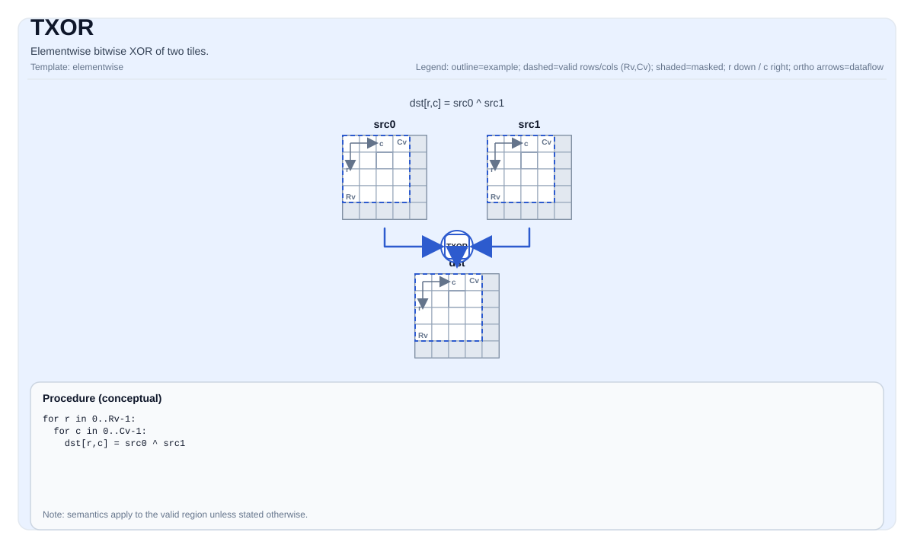

# TXOR

## 指令示意图



## 简介

两个 Tile 的逐元素按位异或。

## 数学语义

对每个元素 `(i, j)` 在有效区域内：

$$ \mathrm{dst}_{i,j} = \mathrm{src0}_{i,j} \oplus \mathrm{src1}_{i,j} $$

## C++ 内建接口

声明于 `include/pto/common/pto_instr.hpp`：

```cpp
template <typename TileDataDst, typename TileDataSrc0, typename TileDataSrc1, typename TileDataTmp,
          typename... WaitEvents>
PTO_INST RecordEvent TXOR(TileDataDst &dst, TileDataSrc0 &src0, TileDataSrc1 &src1, TileDataTmp &tmp, WaitEvents &... events);
```

## 约束

- 该操作在 `dst.GetValidRow()` / `dst.GetValidCol()` 上迭代。
- **实现检查 (A5)**:
    - `dst`、`src0` 和 `src1` 的元素类型必须一致。
    - 支持的元素类型为 `uint8_t`、`int8_t`、`uint16_t`、`int16_t`、`uint32_t`、`int32_t`。
    - `dst`、`src0` 和 `src1` 必须是行主序。
    - `src0.GetValidRow()/GetValidCol()` 和 `src1.GetValidRow()/GetValidCol()` 必须与 `dst` 一致。
- **实现检查 (A2A3)**:
    - `dst`、`src0`、`src1` 和 `tmp` 的元素类型必须一致。
    - 支持的元素类型为 `uint8_t`、`int8_t`、`uint16_t`、`int16_t`、`uint32_t`、`int32_t`。
    - `dst`、`src0`、`src1` 和 `tmp` 必须是行主序。
    - `src0`、`src1` 和 `tmp` 的有效形状必须不小于 `dst`。
    - 在手动模式下，`dst`、`src0`、`src1` 和 `tmp` 的内存区域不得重叠。

## 临时空间

### A2A3

`tmp` **被使用**作为中间暂存存储。A2A3 实现通过分解计算 XOR：`XOR(a,b) = AND(NOT(AND(a,b)), OR(a,b))`，需要 `tmp` 来保存中间结果 `OR(a,b)`。

- `tmp` 必须与 `dst`/`src0`/`src1` 具有相同的元素类型。
- `tmp` 必须是行主序。
- `tmp.GetValidRow() >= dst.GetValidRow()` 且 `tmp.GetValidCol() >= dst.GetValidCol()`。
- 在手动模式下，`tmp` 的内存区域不得与 `dst`、`src0` 或 `src1` 重叠。

### A5

`tmp` 被接口接受但 A5 实现**不使用**。A5 后端直接使用 `vxor` 向量指令，不需要暂存 Tile 存储。`tmp` 仅为了与 A2A3 的 API 兼容性而保留在 C++ 内建接口签名中。

## 示例

```cpp
#include <pto/pto-inst.hpp>

using namespace pto;

void example() {
  using TileDst = Tile<TileType::Vec, uint32_t, 16, 16>;
  using TileSrc0 = Tile<TileType::Vec, uint32_t, 16, 16>;
  using TileSrc1 = Tile<TileType::Vec, uint32_t, 16, 16>;
  using TileTmp = Tile<TileType::Vec, uint32_t, 16, 16>;
  TileDst dst;
  TileSrc0 src0;
  TileSrc1 src1;
  TileTmp tmp;
  TXOR(dst, src0, src1, tmp);
}
```

