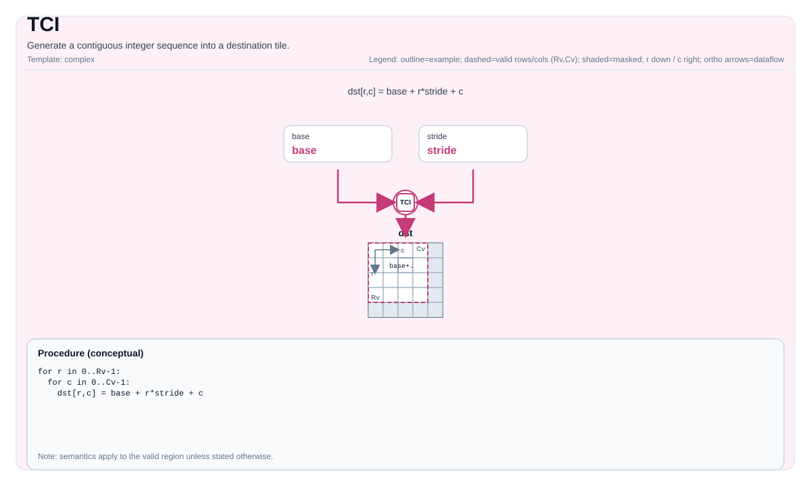

# TCI


## 指令示意图




## 简介


生成连续整数序列到目标 Tile 中。

## 数学语义


For a linearized index `k` over the valid elements:

- Ascending:

  $$ \mathrm{dst}_{k} = S + k $$

- Descending:

  $$ \mathrm{dst}_{k} = S - k $$

The linearization order depends on the tile layout (implementation-defined).

## 汇编语法


PTO-AS 形式：参见 [Assembly Spelling And Operands](../../../syntax-and-operands/assembly-model_zh.md).

同步形式：

```text
%dst = tci %S {descending = false} : !pto.tile<...>
```

### AS Level 1（SSA）


```text
%dst = pto.tci %scalar {descending = false} : dtype -> !pto.tile<...>
```

### AS Level 2（DPS）


```text
pto.tci ins(%scalar {descending = false} : dtype) outs(%dst : !pto.tile_buf<...>)
```

## C++ 内建接口


声明于 `include/pto/common/pto_instr.hpp`：

```cpp
template <typename TileData, typename T, int descending, typename... WaitEvents>
PTO_INST RecordEvent TCI(TileData &dst, T start, WaitEvents &... events);
```

## 约束


!!! warning "约束"
    - **实现检查 (A2A3/A5)**:
        - `TileData::DType` must be exactly the same type as the scalar template parameter `T`.
        - `dst/scalar` element types must be identical, and must be one of: `int32_t`, `uint32_t`, `int16_t`, `uint16_t`.
        - `TileData::Cols != 1` (this is the condition enforced by the implementation).
    - **有效区域**:
        - The implementation uses `dst.GetValidCol()` as the sequence length and does not consult `dst.GetValidRow()`.

## 示例


### 自动（Auto）


```cpp
#include <pto/pto-inst.hpp>

using namespace pto;

void example_auto() {
  using TileT = Tile<TileType::Vec, int32_t, 1, 16>;
  TileT dst;
  TCI<TileT, int32_t, /*descending=*/0>(dst, /*S=*/0);
}
```

### 手动（Manual）


```cpp
#include <pto/pto-inst.hpp>

using namespace pto;

void example_manual() {
  using TileT = Tile<TileType::Vec, int32_t, 1, 16>;
  TileT dst;
  TASSIGN(dst, 0x1000);
  TCI<TileT, int32_t, /*descending=*/1>(dst, /*S=*/100);
}
```

# pto.tci
本节与英文同名章节对齐，后续可继续补充更细粒度中文说明。

## Summary
本节给出该指令/主题的核心语义与使用定位，和英文章节保持一致。

## Mechanism
本节说明执行机制与关键语义规则，细节与边界条件以英文版为准。

## Syntax
本节列出语法形态（SSA / DPS / Assembly），用于与英文页逐项对照。

### AS Level 1 (SSA)
本节与英文同名章节对齐，后续可继续补充更细粒度中文说明。

### AS Level 2 (DPS)
本节与英文同名章节对齐，后续可继续补充更细粒度中文说明。

### IR Level 1 (SSA)
本节与英文同名章节对齐，后续可继续补充更细粒度中文说明。

### IR Level 2 (DPS)
本节与英文同名章节对齐，后续可继续补充更细粒度中文说明。

## C++ Intrinsic
本节给出 C++ 内建接口入口与参数语义说明。

## Inputs
本节定义输入操作数角色、数据来源与有效区域要求。

## Expected Outputs
本节定义输出结果及其在有效区域内的语义保证。

## Side Effects
本节说明除结果写回外是否存在额外可观察副作用。

## Constraints
本节列出类型、布局、shape、valid-region 与 profile 相关约束。

## Exceptions
本节描述非法输入、不支持组合与验证失败行为。

## Target-Profile Restrictions
本节给出 A2/A3、A5 及 CPU-SIM 的差异化限制与行为说明。

## Examples
本节提供 Auto/Manual 及 AS 形式示例，便于中英文对照复现。

### Auto
本节与英文同名章节对齐，后续可继续补充更细粒度中文说明。

### Manual
本节与英文同名章节对齐，后续可继续补充更细粒度中文说明。

### Auto Mode
本节与英文同名章节对齐，后续可继续补充更细粒度中文说明。

# Auto mode: compiler/runtime-managed placement and scheduling.
本节与英文同名章节对齐，后续可继续补充更细粒度中文说明。

### Manual Mode
本节与英文同名章节对齐，后续可继续补充更细粒度中文说明。

# Manual mode: bind resources explicitly before issuing the instruction.
本节与英文同名章节对齐，后续可继续补充更细粒度中文说明。

# Optional for tile operands:
本节与英文同名章节对齐，后续可继续补充更细粒度中文说明。

# pto.tassign %arg0, @tile(0x1000)
本节与英文同名章节对齐，后续可继续补充更细粒度中文说明。

# pto.tassign %arg1, @tile(0x2000)
本节与英文同名章节对齐，后续可继续补充更细粒度中文说明。

### PTO Assembly Form
本节与英文同名章节对齐，后续可继续补充更细粒度中文说明。

# AS Level 2 (DPS)
本节与英文同名章节对齐，后续可继续补充更细粒度中文说明。

## Related Ops / Instruction Set Links
本节给出上下游指令与相关章节链接。
