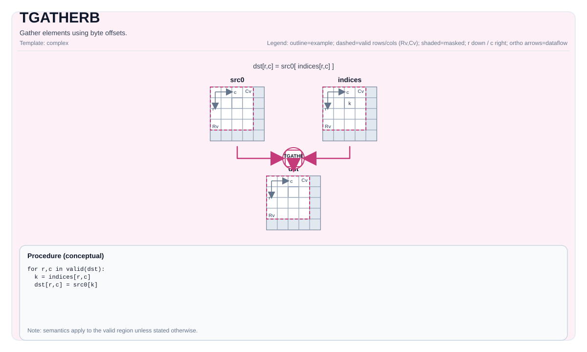

# TGATHERB


## 指令示意图




## 简介


使用字节偏移量收集元素。

## 数学语义


对每个元素 在有效区域内：

$$ \mathrm{dst}_{i,j} = *\left(\mathrm{srcBase} + \mathrm{offset}_{i,j}\right) $$

Exact bounds behavior is implementation-defined.

## 汇编语法


PTO-AS 形式：参见 [Assembly Spelling And Operands](../../../syntax-and-operands/assembly-model_zh.md).

同步形式：

```text
%dst = tgatherb %src, %offsets : !pto.tile<...> -> !pto.tile<...>
```

### AS Level 1（SSA）


```text
%dst = pto.tgatherb %src, %offsets : (!pto.tile<...>, !pto.tile<...>) -> !pto.tile<...>
```

### AS Level 2（DPS）


```text
pto.tgatherb ins(%src, %offsets : !pto.tile_buf<...>, !pto.tile_buf<...>) outs(%dst : !pto.tile_buf<...>)
```

## C++ 内建接口


声明于 `include/pto/common/pto_instr.hpp`：

```cpp
template <typename TileDataDst, typename TileDataSrc, typename TileDataOffset, typename... WaitEvents>
PTO_INST RecordEvent TGATHERB(TileDataDst &dst, TileDataSrc &src, TileDataOffset &offset, WaitEvents &... events);
```

## 约束


!!! warning "约束"
    - **实现检查 (A2A3)**:
        - Destination layout must be row-major (`TileDataDst::isRowMajor`).
        - Destination element size must be `1`, `2`, or `4` bytes (enforced via `static_assert` in the helper).
        - `SrcTileData::DType`/`DstTileData::DType` must be `int8_t` or `uint8_t` or `int16_t` or `uint16_t` or `int32_t` or `uint32_t` or `half` or `bfloat16_t` or `float`.
    - **实现检查 (A5)**:
        - Destination element size must be `1`, `2`, or `4` bytes.
        - `SrcTileData::DType`/`DstTileData::DType` must be `int8_t` or `uint8_t` or `int16_t` or `uint16_t` or `int32_t` or `uint32_t` or `half` or `bfloat16_t` or `float`.
    - **Offset interpretation**:
        - Offsets are interpreted as `uint32_t` values (byte offsets) by the implementation.
        - Offset bounds are not validated by explicit runtime assertions; out-of-range offsets are target-defined.

## 示例


### 自动（Auto）


```cpp
#include <pto/pto-inst.hpp>

using namespace pto;

void example_auto() {
  using SrcT = Tile<TileType::Vec, uint8_t, 1, 256>;
  using OffT = Tile<TileType::Vec, uint32_t, 1, 256>;
  using DstT = Tile<TileType::Vec, uint8_t, 1, 256>;
  SrcT src;
  OffT off;
  DstT dst;
  TGATHERB(dst, src, off);
}
```

### 手动（Manual）


```cpp
#include <pto/pto-inst.hpp>

using namespace pto;

void example_manual() {
  using SrcT = Tile<TileType::Vec, uint8_t, 1, 256>;
  using OffT = Tile<TileType::Vec, uint32_t, 1, 256>;
  using DstT = Tile<TileType::Vec, uint8_t, 1, 256>;
  SrcT src;
  OffT off;
  DstT dst;
  TASSIGN(src, 0x1000);
  TASSIGN(off, 0x2000);
  TASSIGN(dst, 0x3000);
  TGATHERB(dst, src, off);
}
```

# pto.tgatherb
本节与英文同名章节对齐，后续可继续补充更细粒度中文说明。

## Summary
本节给出该指令/主题的核心语义与使用定位，和英文章节保持一致。

## Mechanism
本节说明执行机制与关键语义规则，细节与边界条件以英文版为准。

## Syntax
本节列出语法形态（SSA / DPS / Assembly），用于与英文页逐项对照。

### AS Level 1 (SSA)
本节与英文同名章节对齐，后续可继续补充更细粒度中文说明。

### AS Level 2 (DPS)
本节与英文同名章节对齐，后续可继续补充更细粒度中文说明。

### IR Level 1 (SSA)
本节与英文同名章节对齐，后续可继续补充更细粒度中文说明。

### IR Level 2 (DPS)
本节与英文同名章节对齐，后续可继续补充更细粒度中文说明。

## C++ Intrinsic
本节给出 C++ 内建接口入口与参数语义说明。

## Inputs
本节定义输入操作数角色、数据来源与有效区域要求。

## Expected Outputs
本节定义输出结果及其在有效区域内的语义保证。

## Side Effects
本节说明除结果写回外是否存在额外可观察副作用。

## Constraints
本节列出类型、布局、shape、valid-region 与 profile 相关约束。

## Exceptions
本节描述非法输入、不支持组合与验证失败行为。

## Target-Profile Restrictions
本节给出 A2/A3、A5 及 CPU-SIM 的差异化限制与行为说明。

## Examples
本节提供 Auto/Manual 及 AS 形式示例，便于中英文对照复现。

### Auto
本节与英文同名章节对齐，后续可继续补充更细粒度中文说明。

### Manual
本节与英文同名章节对齐，后续可继续补充更细粒度中文说明。

### Auto Mode
本节与英文同名章节对齐，后续可继续补充更细粒度中文说明。

# Auto mode: compiler/runtime-managed placement and scheduling.
本节与英文同名章节对齐，后续可继续补充更细粒度中文说明。

### Manual Mode
本节与英文同名章节对齐，后续可继续补充更细粒度中文说明。

# Manual mode: bind resources explicitly before issuing the instruction.
本节与英文同名章节对齐，后续可继续补充更细粒度中文说明。

# Optional for tile operands:
本节与英文同名章节对齐，后续可继续补充更细粒度中文说明。

# pto.tassign %arg0, @tile(0x1000)
本节与英文同名章节对齐，后续可继续补充更细粒度中文说明。

# pto.tassign %arg1, @tile(0x2000)
本节与英文同名章节对齐，后续可继续补充更细粒度中文说明。

### PTO Assembly Form
本节与英文同名章节对齐，后续可继续补充更细粒度中文说明。

# AS Level 2 (DPS)
本节与英文同名章节对齐，后续可继续补充更细粒度中文说明。

## Related Ops / Instruction Set Links
本节给出上下游指令与相关章节链接。
