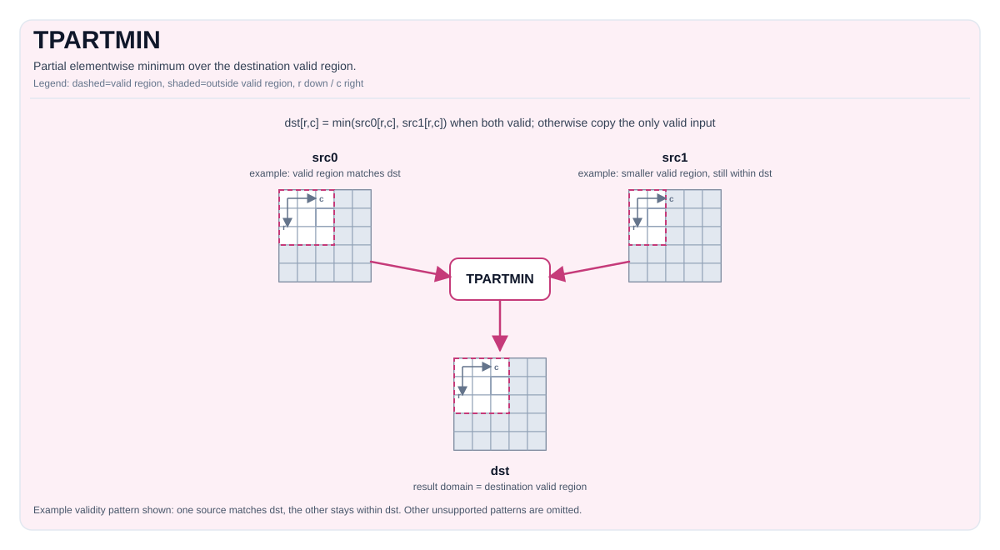

# TPARTMIN

## 指令示意图




## 简介


在目标有效区域内执行逐元素最小值选择。若某个位置上 `src0` 和 `src1` 都有效，则结果为 `min(src0, src1)`；若只有一个输入在该位置有效，则结果直接取该输入的值。其余有效区域不匹配的情况由具体实现定义。

## 数学语义


对目标有效区域内的每个元素 `(i, j)`：

$$
\mathrm{dst}_{i,j} =
\begin{cases}
\min(\mathrm{src0}_{i,j}, \mathrm{src1}_{i,j}) & \text{若两个输入在 } (i,j) \text{ 处均有定义} \\\\
\mathrm{src0}_{i,j} & \text{若仅 src0 在 } (i,j) \text{ 处有定义} \\\\
\mathrm{src1}_{i,j} & \text{若仅 src1 在 } (i,j) \text{ 处有定义}
\end{cases}
$$

## 汇编语法


PTO-AS 形式：参见 [汇编写法与操作数](../../../syntax-and-operands/assembly-model_zh.md)。

同步形式：

```text
%dst = tpartmin %src0, %src1 : !pto.tile<...> -> !pto.tile<...>
```

### AS Level 1（SSA）


```text
%dst = pto.tpartmin %src0, %src1 : (!pto.tile<...>, !pto.tile<...>) -> !pto.tile<...>
```

### AS Level 2（DPS）


```text
pto.tpartmin ins(%src0, %src1 : !pto.tile_buf<...>, !pto.tile_buf<...>) outs(%dst : !pto.tile_buf<...>)
```

## C++ 内建接口


声明于 `include/pto/common/pto_instr.hpp`：

```cpp
template <typename TileDataDst, typename TileDataSrc0, typename TileDataSrc1, typename... WaitEvents>
PTO_INST RecordEvent TPARTMIN(TileDataDst &dst, TileDataSrc0 &src0, TileDataSrc1 &src1, WaitEvents &... events);
```

## 约束


!!! warning "约束"
    ### 通用约束或检查

    - `dst`、`src0` 和 `src1` 的元素类型必须一致。
    - 目标有效区域定义结果的计算范围。
    - 对目标有效区域内的每个元素：
      - 若两个输入都有效，则执行逐元素最小值运算；
      - 若只有一个输入有效，则结果直接取该输入的值。
    - 若 `dst` 的有效区域为零，指令直接返回。
    - 支持的部分有效区域模式要求至少有一个源 Tile 的有效区域与 `dst` 完全一致，另一个源 Tile 的有效区域在两个维度上都不能超过 `dst`。
    - 上述范围之外的有效区域组合，其行为均由具体实现定义。

    ### A2A3 实现检查

    - 支持的元素类型：`int32_t`、`int16_t`、`half`、`float`。
    - `dst`、`src0` 和 `src1` 必须全部为行主序（`isRowMajor`）。

    ### A5 实现检查

    - 支持的元素类型：`int8_t`、`uint8_t`、`int16_t`、`uint16_t`、`int32_t`、`uint32_t`、`half`、`bfloat16_t`、`float`。

## 示例


### 自动（Auto）


```cpp
#include <pto/pto-inst.hpp>

using namespace pto;

void example_auto() {
  using TileT = Tile<TileType::Vec, float, 16, 16>;
  TileT src0, src1, dst;
  TPARTMIN(dst, src0, src1);
}
```

### 手动（Manual）


```cpp
#include <pto/pto-inst.hpp>

using namespace pto;

void example_manual() {
  using TileT = Tile<TileType::Vec, float, 16, 16>;
  TileT src0, src1, dst;
  TASSIGN(src0, 0x1000);
  TASSIGN(src1, 0x2000);
  TASSIGN(dst,  0x3000);
  TPARTMIN(dst, src0, src1);
}
```

## 汇编示例（ASM）


### 自动模式


```text
# 自动模式：由编译器/运行时负责资源放置与调度。
%dst = pto.tpartmin %src0, %src1 : (!pto.tile<...>, !pto.tile<...>) -> !pto.tile<...>
```

### 手动模式


```text
# 手动模式：先显式绑定资源，再发射指令。
# 可选（当该指令包含 tile 操作数时）：
# pto.tassign %arg0, @tile(0x1000)
# pto.tassign %arg1, @tile(0x2000)
%dst = pto.tpartmin %src0, %src1 : (!pto.tile<...>, !pto.tile<...>) -> !pto.tile<...>
```

### PTO 汇编形式


```text
%dst = tpartmin %src0, %src1 : !pto.tile<...> -> !pto.tile<...>
# AS Level 2 (DPS)
pto.tpartmin ins(%src0, %src1 : !pto.tile_buf<...>, !pto.tile_buf<...>) outs(%dst : !pto.tile_buf<...>)
```

# pto.tpartmin
本节与英文同名章节对齐，后续可继续补充更细粒度中文说明。

## Summary
本节给出该指令/主题的核心语义与使用定位，和英文章节保持一致。

## Mechanism
本节说明执行机制与关键语义规则，细节与边界条件以英文版为准。

## Syntax
本节列出语法形态（SSA / DPS / Assembly），用于与英文页逐项对照。

### AS Level 1 (SSA)
本节与英文同名章节对齐，后续可继续补充更细粒度中文说明。

## C++ Intrinsic
本节给出 C++ 内建接口入口与参数语义说明。

## Inputs
本节定义输入操作数角色、数据来源与有效区域要求。

## Expected Outputs
本节定义输出结果及其在有效区域内的语义保证。

## Side Effects
本节说明除结果写回外是否存在额外可观察副作用。

## Constraints
本节列出类型、布局、shape、valid-region 与 profile 相关约束。

## Exceptions
本节描述非法输入、不支持组合与验证失败行为。

## Target-Profile Restrictions
本节给出 A2/A3、A5 及 CPU-SIM 的差异化限制与行为说明。

## Examples
本节提供 Auto/Manual 及 AS 形式示例，便于中英文对照复现。

### Auto
本节与英文同名章节对齐，后续可继续补充更细粒度中文说明。

### Manual
本节与英文同名章节对齐，后续可继续补充更细粒度中文说明。

### Auto Mode
本节与英文同名章节对齐，后续可继续补充更细粒度中文说明。

# Auto mode: compiler/runtime-managed placement and scheduling.
本节与英文同名章节对齐，后续可继续补充更细粒度中文说明。

### Manual Mode
本节与英文同名章节对齐，后续可继续补充更细粒度中文说明。

# Manual mode: bind resources explicitly before issuing the instruction.
本节与英文同名章节对齐，后续可继续补充更细粒度中文说明。

# Optional for tile operands:
本节与英文同名章节对齐，后续可继续补充更细粒度中文说明。

### PTO Assembly Form
本节与英文同名章节对齐，后续可继续补充更细粒度中文说明。

## Related Ops / Instruction Set Links
本节给出上下游指令与相关章节链接。
