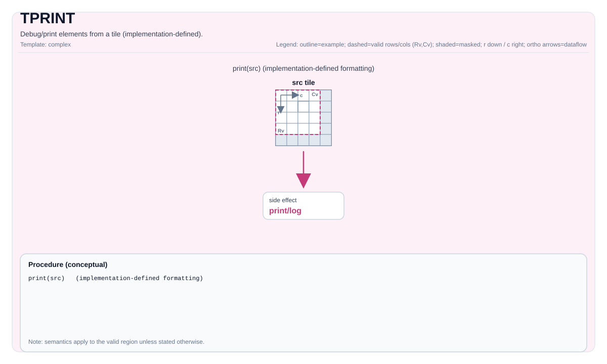

# TPRINT

## 指令示意图




## 简介


调试/打印 Tile 中的元素（实现定义）。

从设备代码直接打印 Tile 或 GlobalTensor 的内容以用于调试目的。

`TPRINT` 指令输出存储在 Tile 或 GlobalTensor 中的数据的逻辑视图。它支持常见的数据类型（例如 `float`、`half`、`int8`、`uint32`）和多种内存布局（GlobalTensor 的 `ND`、`DN`、`NZ`；片上缓冲区的向量 tiles）。

> **重要**:
> - 此指令**仅用于开发和调试**。
> - 它会产生**显著的运行时开销**，**不得在生产 kernel 中使用**。
> - 如果输出超过内部打印缓冲区，可能会被**截断**。可以通过在编译选项中添加`-DCCEBlockMaxSize=16384`来修改打印缓冲区，默认为16KB。
> - **需要 CCE 编译选项 `-D_DEBUG --cce-enable-print`**（参见 [行为](#behavior)）。

## 数学语义


除非另有说明，语义在有效区域上定义，目标相关的行为标记为实现定义。

## 汇编语法


PTO-AS 形式：参见 [汇编写法与操作数](../../../syntax-and-operands/assembly-model_zh.md)。

```text
tprint %src : !pto.tile<...> | !pto.global<...>
```

### AS Level 1（SSA）


```text
pto.tprint %src : !pto.tile<...> | !pto.partition_tensor_view<MxNxdtype> -> ()
```

### AS Level 2（DPS）


```text
pto.tprint ins(%src : !pto.tile_buf<...> | !pto.partition_tensor_view<MxNxdtype>)
```

## C++ 内建接口


声明于 `include/pto/common/pto_instr.hpp`：
```cpp
// 适用于打印GlobalTensor或Vec类型Tile
template <typename TileData>
PTO_INST void TPRINT(TileData &src);

// 适用于打印Acc类型Tile和Mat类型Tile(Mat打印仅适用于A3，A5暂不支持)
template <typename TileData, typename GlobalData>
PTO_INTERNAL void TPRINT(TileData &src, GlobalData &tmp);
```

### 支持的 T 类型
- **Tile**：TileType必须是`Vec`、`Acc`、`Mat(仅A3支持)`，并具有支持的元素类型。
- **GlobalTensor**：必须使用布局 `ND`、`DN` 或 `NZ`，并具有支持的元素类型。

## 约束


!!! warning "约束"
    - **支持的元素类型**:
        - 浮点数：`float`、`half`
        - 有符号整数：`int8_t`、`int16_t`、`int32_t`
        - 无符号整数：`uint8_t`、`uint16_t`、`uint32_t`
    - **对于 GlobalTensor**：布局必须是 `Layout::ND`、`Layout::DN` 或 `Layout::NZ` 之一。
    - **对于 临时空间**：打印`TileType`为`Mat`或`Acc`的Tile时需要传入gm上的临时空间，临时空间不得小于`TileData::Numel * sizeof(T)`。
    - A5暂不支持`TileType`为`Mat`的Tile打印。
    - **回显信息**: `TileType`为`Mat`时，布局将按照`Layout::ND`进行打印，其他布局可能会导致信息错位。

## 示例


### Print a Tile


```cpp
#include <pto/pto-inst.hpp>

PTO_INTERNAL void DebugTile(__gm__ float *src) {
  using ValidSrcShape = TileShape2D<float, 16, 16>;
  using NDSrcShape = BaseShape2D<float, 32, 32>;
  using GlobalDataSrc = GlobalTensor<float, ValidSrcShape, NDSrcShape>;
  GlobalDataSrc srcGlobal(src);

  using srcTileData = Tile<TileType::Vec, float, 16, 16>;
  srcTileData srcTile;
  TASSIGN(srcTile, 0x0);

  TLOAD(srcTile, srcGlobal);
  TPRINT(srcTile);
}
```

### Print a GlobalTensor


```cpp
#include <pto/pto-inst.hpp>

PTO_INTERNAL void DebugGlobalTensor(__gm__ float *src) {
  using ValidSrcShape = TileShape2D<float, 16, 16>;
  using NDSrcShape = BaseShape2D<float, 32, 32>;
  using GlobalDataSrc = GlobalTensor<float, ValidSrcShape, NDSrcShape>;
  GlobalDataSrc srcGlobal(src);

  TPRINT(srcGlobal);
}
```

## 汇编示例（ASM）


### 自动模式


```text
# 自动模式：由编译器/运行时负责资源放置与调度。
pto.tprint %src : !pto.tile<...> | !pto.partition_tensor_view<MxNxdtype> -> ()
```

### 手动模式


```text
# 手动模式：先显式绑定资源，再发射指令。
# 可选（当该指令包含 tile 操作数时）：
# pto.tassign %arg0, @tile(0x1000)
# pto.tassign %arg1, @tile(0x2000)
pto.tprint %src : !pto.tile<...> | !pto.partition_tensor_view<MxNxdtype> -> ()
```

### PTO 汇编形式


```text
pto.tprint %src : !pto.tile<...> | !pto.partition_tensor_view<MxNxdtype> -> ()
# AS Level 2 (DPS)
pto.tprint ins(%src : !pto.tile_buf<...> | !pto.partition_tensor_view<MxNxdtype>)
```

# pto.tprint
本节与英文同名章节对齐，后续可继续补充更细粒度中文说明。

## Summary
本节给出该指令/主题的核心语义与使用定位，和英文章节保持一致。

## Mechanism
本节说明执行机制与关键语义规则，细节与边界条件以英文版为准。

## Syntax
本节列出语法形态（SSA / DPS / Assembly），用于与英文页逐项对照。

### AS Level 1 (SSA)
本节与英文同名章节对齐，后续可继续补充更细粒度中文说明。

### IR Level 1 (SSA)
本节与英文同名章节对齐，后续可继续补充更细粒度中文说明。

### IR Level 2 (DPS)
本节与英文同名章节对齐，后续可继续补充更细粒度中文说明。

## C++ Intrinsic
本节给出 C++ 内建接口入口与参数语义说明。

### Supported Types for T
本节与英文同名章节对齐，后续可继续补充更细粒度中文说明。

## Inputs
本节定义输入操作数角色、数据来源与有效区域要求。

## Expected Outputs
本节定义输出结果及其在有效区域内的语义保证。

## Side Effects
本节说明除结果写回外是否存在额外可观察副作用。

## Constraints
本节列出类型、布局、shape、valid-region 与 profile 相关约束。

## Exceptions
本节描述非法输入、不支持组合与验证失败行为。

## Target-Profile Restrictions
本节给出 A2/A3、A5 及 CPU-SIM 的差异化限制与行为说明。

## Examples
本节提供 Auto/Manual 及 AS 形式示例，便于中英文对照复现。

### Auto Mode
本节与英文同名章节对齐，后续可继续补充更细粒度中文说明。

# Auto mode: compiler/runtime-managed placement and scheduling.
本节与英文同名章节对齐，后续可继续补充更细粒度中文说明。

### Manual Mode
本节与英文同名章节对齐，后续可继续补充更细粒度中文说明。

# Manual mode: bind resources explicitly before issuing the instruction.
本节与英文同名章节对齐，后续可继续补充更细粒度中文说明。

# Optional for tile operands:
本节与英文同名章节对齐，后续可继续补充更细粒度中文说明。

### PTO Assembly Form
本节与英文同名章节对齐，后续可继续补充更细粒度中文说明。

## Related Ops / Instruction Set Links
本节给出上下游指令与相关章节链接。
