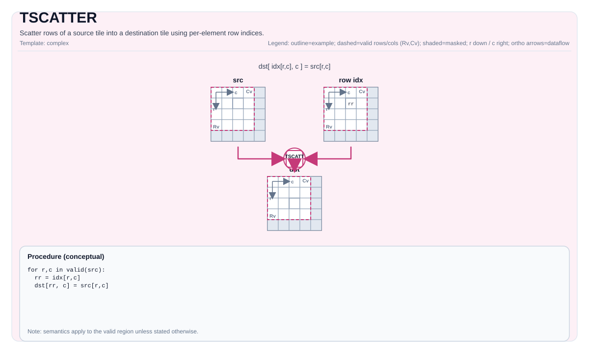

# TSCATTER


## 指令示意图




## 简介


`TSCATTER` 按索引 Tile 给出的目标偏移，把源 Tile 中的元素分散写入目标 Tile。它适合表达“不规则写回到本地 Tile”这类模式：数据仍然留在 tile 空间里，但目的位置不再由规则的行列映射决定。

和规则搬运不同，`TSCATTER` 的关键输入不是另一个 shape，而是 `indexes`。每个索引元素都表示目标 Tile 在线性存储视角下的一个元素偏移。

## 数学语义


设：

- `R = indexes.GetValidRow()`
- `C = indexes.GetValidCol()`

当前实现会先把整个 `dst` Tile 清零，然后对 `0 <= i < R`、`0 <= j < C` 执行：

$$ \mathrm{dst\_flat}_{\mathrm{indexes}_{i,j}} = \mathrm{src}_{i,j} $$

其中 `dst_flat` 表示把目标 Tile 按其存储顺序看成一段线性序列。对标准 row-major Tile 来说，这就是“写到扁平化后的第 `k` 个元素”。

这条语义有三个读者容易忽略的点：

- `TSCATTER` 按 `indexes` 的 valid region 遍历，而不是按 `dst` 的 valid region 遍历。
- 没有被任何索引命中的目标位置，在当前实现里保持为零值，而不是保留调用前的 `dst` 内容。
- 如果多个源元素落到同一个目标位置，最终值属于实现定义行为；当前实现按行优先顺序遍历，因此后写入的元素会覆盖前值。

## 汇编语法


PTO-AS 形式：参见 [汇编写法与操作数](../../../syntax-and-operands/assembly-model_zh.md)。

同步形式：

```text
%dst = tscatter %src, %idx : !pto.tile<...>, !pto.tile<...> -> !pto.tile<...>
```

### AS Level 1（SSA）


```text
%dst = pto.tscatter %src, %idx : (!pto.tile<...>, !pto.tile<...>) -> !pto.tile<...>
```

### AS Level 2（DPS）


```text
pto.tscatter ins(%src, %idx : !pto.tile_buf<...>, !pto.tile_buf<...>) outs(%dst : !pto.tile_buf<...>)
```

## C++ 内建接口


声明于 `include/pto/common/pto_instr.hpp`：

```cpp
template <typename TileDataD, typename TileDataS, typename TileDataI, typename... WaitEvents>
PTO_INST RecordEvent TSCATTER(TileDataD &dst, TileDataS &src, TileDataI &indexes, WaitEvents &... events);
```

## 约束


!!! warning "约束"
    ### 通用约束

    - `dst`、`src`、`indexes` 都必须是 `TileType::Vec`。
    - `dst` 与 `src` 的元素类型必须完全一致。
    - `indexes` 必须是整型 Tile，且索引元素宽度必须和数据元素宽度匹配：
      - 数据为 4 字节时，索引也必须是 4 字节；
      - 数据为 2 字节时，索引也必须是 2 字节；
      - 数据为 1 字节时，索引必须是 2 字节。
    - 实现按 `indexes.GetValidRow()` / `indexes.GetValidCol()` 遍历。可移植代码应保证 `src` 在同一坐标域内可读。
    - 当前 backend 不会对索引做越界检查。超出目标 Tile 线性范围的索引不属于合法使用域。
    - 编译期 valid bounds 必须满足：
      - `TileDataD::ValidRow <= TileDataD::Rows`
      - `TileDataD::ValidCol <= TileDataD::Cols`
      - `TileDataS::ValidRow <= TileDataS::Rows`
      - `TileDataS::ValidCol <= TileDataS::Cols`
      - `TileDataI::ValidRow <= TileDataI::Rows`
      - `TileDataI::ValidCol <= TileDataI::Cols`

    ### A2/A3 实现检查

    - `dst/src` 的元素类型必须属于：
      `int32_t`、`int16_t`、`int8_t`、`uint32_t`、`uint16_t`、`uint8_t`、`half`、`float32_t`、`bfloat16_t`。
    - `indexes` 的元素类型必须属于：
      `int16_t`、`int32_t`、`uint16_t`、`uint32_t`。

    ### A5 实现检查

    - A5 上的类型限制与 A2/A3 相同：
      - `dst/src` 支持 `int32_t`、`int16_t`、`int8_t`、`uint32_t`、`uint16_t`、`uint8_t`、`half`、`float32_t`、`bfloat16_t`
      - `indexes` 支持 `int16_t`、`int32_t`、`uint16_t`、`uint32_t`

## 示例


### 自动（Auto）


```cpp
#include <pto/pto-inst.hpp>

using namespace pto;

void example_auto() {
  using TileT = Tile<TileType::Vec, float, 16, 16>;
  using IdxT = Tile<TileType::Vec, uint16_t, 16, 16>;
  TileT src, dst;
  IdxT idx;
  TSCATTER(dst, src, idx);
}
```

### 手动（Manual）


```cpp
#include <pto/pto-inst.hpp>

using namespace pto;

void example_manual() {
  using TileT = Tile<TileType::Vec, float, 16, 16>;
  using IdxT = Tile<TileType::Vec, uint16_t, 16, 16>;
  TileT src, dst;
  IdxT idx;
  TASSIGN(src, 0x1000);
  TASSIGN(dst, 0x2000);
  TASSIGN(idx, 0x3000);
  TSCATTER(dst, src, idx);
}
```

## 相关页面


- [不规则与复杂指令集](../../irregular-and-complex_zh.md)
- [布局参考](../../../state-and-types/layout_zh.md)
- [数据格式](../../../state-and-types/data-format_zh.md)

# pto.tscatter
本节与英文同名章节对齐，后续可继续补充更细粒度中文说明。

## Summary
本节给出该指令/主题的核心语义与使用定位，和英文章节保持一致。

## Mechanism
本节说明执行机制与关键语义规则，细节与边界条件以英文版为准。

## Syntax
本节列出语法形态（SSA / DPS / Assembly），用于与英文页逐项对照。

### IR Level 1 (SSA)
本节与英文同名章节对齐，后续可继续补充更细粒度中文说明。

### IR Level 2 (DPS)
本节与英文同名章节对齐，后续可继续补充更细粒度中文说明。

## C++ Intrinsic
本节给出 C++ 内建接口入口与参数语义说明。

## Inputs
本节定义输入操作数角色、数据来源与有效区域要求。

## Expected Outputs
本节定义输出结果及其在有效区域内的语义保证。

## Side Effects
本节说明除结果写回外是否存在额外可观察副作用。

## Constraints
本节列出类型、布局、shape、valid-region 与 profile 相关约束。

## Exceptions
本节描述非法输入、不支持组合与验证失败行为。

## Target-Profile Restrictions
本节给出 A2/A3、A5 及 CPU-SIM 的差异化限制与行为说明。

## Examples
本节提供 Auto/Manual 及 AS 形式示例，便于中英文对照复现。

### Auto
本节与英文同名章节对齐，后续可继续补充更细粒度中文说明。

### Manual
本节与英文同名章节对齐，后续可继续补充更细粒度中文说明。

### Auto Mode
本节与英文同名章节对齐，后续可继续补充更细粒度中文说明。

# Auto mode: compiler/runtime-managed placement and scheduling.
本节与英文同名章节对齐，后续可继续补充更细粒度中文说明。

### Manual Mode
本节与英文同名章节对齐，后续可继续补充更细粒度中文说明。

# Manual mode: bind resources explicitly before issuing the instruction.
本节与英文同名章节对齐，后续可继续补充更细粒度中文说明。

# Optional for tile operands:
本节与英文同名章节对齐，后续可继续补充更细粒度中文说明。

# pto.tassign %arg0, @tile(0x1000)
本节与英文同名章节对齐，后续可继续补充更细粒度中文说明。

# pto.tassign %arg1, @tile(0x2000)
本节与英文同名章节对齐，后续可继续补充更细粒度中文说明。

### PTO Assembly Form
本节与英文同名章节对齐，后续可继续补充更细粒度中文说明。

# IR Level 2 (DPS)
本节与英文同名章节对齐，后续可继续补充更细粒度中文说明。

## Related Ops / Instruction Set Links
本节给出上下游指令与相关章节链接。
