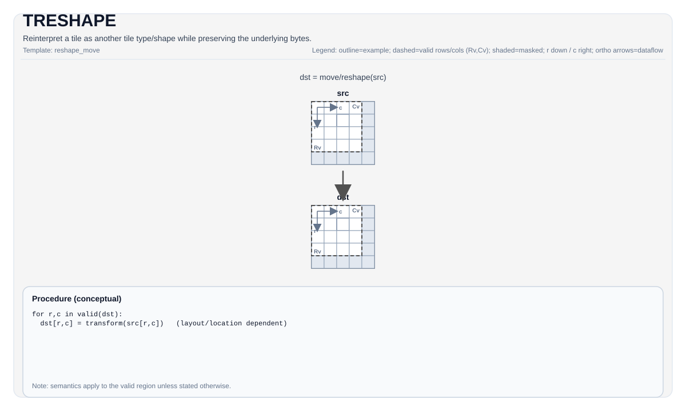

# TRESHAPE


## 指令示意图




## 简介


`TRESHAPE` 重新解释一个 Tile 的字节视图，而不改变底层字节内容。它不是数值转换，也不是数据搬运；它做的是“同一块数据，用另一种 Tile 形状/类型规则来看”。

如果你需要真的改变值，应该找 `TCVT`、`TMOV` 或量化类指令；如果你只是想换一种兼容的 Tile 视图，才使用 `TRESHAPE`。

## 机制


从结果上看，可以把 `TRESHAPE` 理解成：

- `src` 的字节序列保持不变
- `dst` 只是用另一套 Tile 元数据去解释同一批字节

因此它的核心前提不是“形状能不能算”，而是“总字节数和布局类别能不能兼容”。

## 汇编语法


PTO-AS 形式：参见 [汇编写法与操作数](../../../syntax-and-operands/assembly-model_zh.md)。

```text
%dst = treshape %src : !pto.tile<...>
```

### AS Level 1（SSA）


```text
%dst = pto.treshape %src : !pto.tile<...> -> !pto.tile<...>
```

### AS Level 2（DPS）


```text
pto.treshape ins(%src : !pto.tile_buf<...>) outs(%dst : !pto.tile_buf<...>)
```

## C++ 内建接口


声明于 `include/pto/common/pto_instr.hpp`：

```cpp
template <typename TileDataOut, typename TileDataIn, typename... WaitEvents>
PTO_INST RecordEvent TRESHAPE(TileDataOut &dst, TileDataIn &src, WaitEvents &... events);
```

## 约束


!!! warning "约束"
    ### 所有 backend 都共享的硬约束

    - `TileDataIn::Loc == TileDataOut::Loc`
    - `sizeof(InElem) * InNumel == sizeof(OutElem) * OutNumel`
    - 不能在 boxed layout 和 non-boxed layout 之间重解释

    ### CPU 模拟器

    - CPU 还会额外检查元素类型兼容性：
      - 同类型，或
      - 都是浮点，或
      - 都是整数

    ### A2/A3 / A5 / Kirin9030

    - NPU 路径没有 CPU 那么强的“元素类别兼容”检查。
    - A2/A3 在非自动路径下会把 `dst` 直接别名到 `src` 的地址；自动路径用 `__cce_alias`。
    - A5 和 Kirin9030 复用 A2/A3 的 `TRESHAPE` 实现。

    这意味着 `TRESHAPE` 在 NPU 上更接近“受约束的别名/重解释”，而不是一次真实复制。

## 示例


```cpp
#include <pto/pto-inst.hpp>

using namespace pto;

void example() {
  using Src = Tile<TileType::Vec, float, 16, 16>;
  using Dst = Tile<TileType::Vec, float, 8, 32>;
  static_assert(sizeof(typename Src::DType) * Src::Numel == sizeof(typename Dst::DType) * Dst::Numel);

  Src src;
  Dst dst;
  TRESHAPE(dst, src);
}
```

## 相关页面


- [TALIAS](../sync-and-config/talias.md)
- [TMOV](./tmov_zh.md)
- [布局与重排指令集](../../layout-and-rearrangement_zh.md)

# pto.treshape
本节与英文同名章节对齐，后续可继续补充更细粒度中文说明。

## Summary
本节给出该指令/主题的核心语义与使用定位，和英文章节保持一致。

## Mechanism
本节说明执行机制与关键语义规则，细节与边界条件以英文版为准。

## Syntax
本节列出语法形态（SSA / DPS / Assembly），用于与英文页逐项对照。

### AS Level 1 (SSA)
本节与英文同名章节对齐，后续可继续补充更细粒度中文说明。

### AS Level 2 (DPS)
本节与英文同名章节对齐，后续可继续补充更细粒度中文说明。

### IR Level 1 (SSA)
本节与英文同名章节对齐，后续可继续补充更细粒度中文说明。

### IR Level 2 (DPS)
本节与英文同名章节对齐，后续可继续补充更细粒度中文说明。

## C++ Intrinsic
本节给出 C++ 内建接口入口与参数语义说明。

## Inputs
本节定义输入操作数角色、数据来源与有效区域要求。

## Expected Outputs
本节定义输出结果及其在有效区域内的语义保证。

## Side Effects
本节说明除结果写回外是否存在额外可观察副作用。

## Constraints
本节列出类型、布局、shape、valid-region 与 profile 相关约束。

## Exceptions
本节描述非法输入、不支持组合与验证失败行为。

## Target-Profile Restrictions
本节给出 A2/A3、A5 及 CPU-SIM 的差异化限制与行为说明。

## Examples
本节提供 Auto/Manual 及 AS 形式示例，便于中英文对照复现。

### Auto Mode
本节与英文同名章节对齐，后续可继续补充更细粒度中文说明。

# Auto mode: compiler/runtime-managed placement and scheduling.
本节与英文同名章节对齐，后续可继续补充更细粒度中文说明。

### Manual Mode
本节与英文同名章节对齐，后续可继续补充更细粒度中文说明。

# Manual mode: bind resources explicitly before issuing the instruction.
本节与英文同名章节对齐，后续可继续补充更细粒度中文说明。

# Optional for tile operands:
本节与英文同名章节对齐，后续可继续补充更细粒度中文说明。

# pto.tassign %arg0, @tile(0x1000)
本节与英文同名章节对齐，后续可继续补充更细粒度中文说明。

# pto.tassign %arg1, @tile(0x2000)
本节与英文同名章节对齐，后续可继续补充更细粒度中文说明。

### PTO Assembly Form
本节与英文同名章节对齐，后续可继续补充更细粒度中文说明。

# AS Level 2 (DPS)
本节与英文同名章节对齐，后续可继续补充更细粒度中文说明。

## Related Ops / Instruction Set Links
本节给出上下游指令与相关章节链接。
