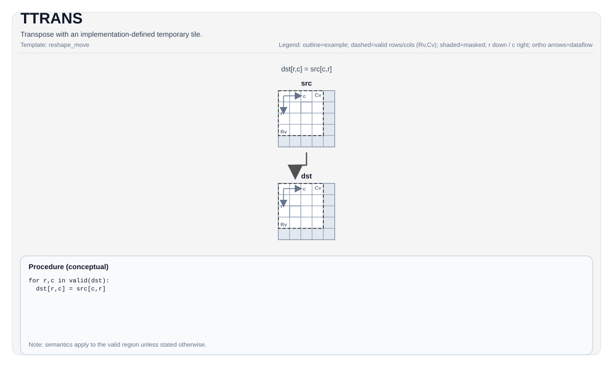

# TTRANS

## 指令示意图




## 简介


使用实现定义的临时 Tile 进行转置。

## 数学语义


对于二维 Tile，在有效转置域上：

$$ \mathrm{dst}_{i,j} = \mathrm{src}_{j,i} $$

确切的形状/布局及转置域取决于目标硬件（参见约束）。

## 汇编语法


PTO-AS 形式：参见 [汇编写法与操作数](../../../syntax-and-operands/assembly-model_zh.md)。

同步形式：

```text
%dst = ttrans %src : !pto.tile<...> -> !pto.tile<...>
```
降低时可能引入内部临时 Tile；C++ 内建接口需要显式传入 `tmp` 操作数。

### AS Level 1（SSA）


```text
%dst = pto.ttrans %src : !pto.tile<...> -> !pto.tile<...>
```

### AS Level 2（DPS）


```text
pto.ttrans ins(%src : !pto.tile_buf<...>) outs(%dst : !pto.tile_buf<...>)
```

## C++ 内建接口


声明于 `include/pto/common/pto_instr.hpp`：

```cpp
template <typename TileDataDst, typename TileDataSrc, typename TileDataTmp, typename... WaitEvents>
PTO_INST RecordEvent TTRANS(TileDataDst &dst, TileDataSrc &src, TileDataTmp &tmp, WaitEvents &... events);
```

## 约束


!!! warning "约束"
    - **实现检查 (A2A3)**:
        - `sizeof(TileDataSrc::DType) == sizeof(TileDataDst::DType)`。
        - 源布局必须是行主序（`TileDataSrc::isRowMajor`）。
        - 元素大小必须是 `1`、`2` 或 `4` 字节。
        - 支持的元素类型按元素宽度限制如下：
        - 4 字节：`uint32_t`、`int32_t`、`float`
        - 2 字节：`uint16_t`、`int16_t`、`half`、`bfloat16_t`
        - 1 字节：`uint8_t`、`int8_t`
        - 转置大小取自 `src.GetValidRow()` / `src.GetValidCol()`。
    - **实现检查 (A5)**:
        - `sizeof(TileDataSrc::DType) == sizeof(TileDataDst::DType)`。
        - 对输入和输出的主维度强制执行 32 字节对齐约束（行主序检查 `Cols * sizeof(T) % 32 == 0`，列主序检查 `Rows * sizeof(T) % 32 == 0`）。
        - 支持的元素类型按元素宽度限制如下：
        - 4 字节：`uint32_t`、`int32_t`、`float`
        - 2 字节：`uint16_t`、`int16_t`、`half`、`bfloat16_t`
        - 1 字节：`uint8_t`、`int8_t`
        - 实现在静态 Tile 形状（`TileDataSrc::Rows/Cols`）上运算，不参考 `GetValidRow/GetValidCol`。
    - **临时 Tile**:
        - C++ API 需要 `tmp`，但某些实现可能不使用它。
    - **ConvTile**:
        - 支持在`TileType::Vec`上的ConvTile的格式转换。其元素大小必须是 `1`、`2` 或 `4` 字节。元素类型限制为`uint32_t`、`int32_t`、`float`、`uint16_t`、`int16_t`、`half`、`bfloat16_t`、`uint8_t`、`int8_t`。
        - 支持ConvTile从`NCHW`到`NC1HWC0`的变换，其中`C1 == (C + C0 - 1)/C0`，HW满足对齐要求，即`H*W*sizeof(T)==0`. C0对应`c0_size`, 即`C0 * sizeof(T) == 32`。C0也可以为4。
        - 支持ConvTile从`NC1HWC0`到`FRACTAL_Z`的变换, 其中`N1 == (N + N0 - 1)/N0`。N0为16。

## 示例


### 自动（Auto）


```cpp
#include <pto/pto-inst.hpp>

using namespace pto;

void example_auto() {
  using SrcT = Tile<TileType::Vec, float, 16, 16>;
  using DstT = Tile<TileType::Vec, float, 16, 16>;
  using TmpT = Tile<TileType::Vec, float, 16, 16>;
  SrcT src;
  DstT dst;
  TmpT tmp;
  TTRANS(dst, src, tmp);
}
```

### 手动（Manual）


```cpp
#include <pto/pto-inst.hpp>

using namespace pto;

void example_manual() {
  using SrcT = Tile<TileType::Vec, float, 16, 16>;
  using DstT = Tile<TileType::Vec, float, 16, 16>;
  using TmpT = Tile<TileType::Vec, float, 16, 16>;
  SrcT src;
  DstT dst;
  TmpT tmp;
  TASSIGN(src, 0x1000);
  TASSIGN(dst, 0x2000);
  TASSIGN(tmp, 0x3000);
  TTRANS(dst, src, tmp);
}
```

## 汇编示例（ASM）


### 自动模式


```text
# 自动模式：由编译器/运行时负责资源放置与调度。
%dst = pto.ttrans %src : !pto.tile<...> -> !pto.tile<...>
```

### 手动模式


```text
# 手动模式：先显式绑定资源，再发射指令。
# 可选（当该指令包含 tile 操作数时）：
# pto.tassign %arg0, @tile(0x1000)
# pto.tassign %arg1, @tile(0x2000)
%dst = pto.ttrans %src : !pto.tile<...> -> !pto.tile<...>
```

### PTO 汇编形式


```text
%dst = ttrans %src : !pto.tile<...> -> !pto.tile<...>
# AS Level 2 (DPS)
pto.ttrans ins(%src : !pto.tile_buf<...>) outs(%dst : !pto.tile_buf<...>)
```

# pto.ttrans
本节与英文同名章节对齐，后续可继续补充更细粒度中文说明。

## Summary
本节给出该指令/主题的核心语义与使用定位，和英文章节保持一致。

## Mechanism
本节说明执行机制与关键语义规则，细节与边界条件以英文版为准。

## Syntax
本节列出语法形态（SSA / DPS / Assembly），用于与英文页逐项对照。

### AS Level 1 (SSA)
本节与英文同名章节对齐，后续可继续补充更细粒度中文说明。

## C++ Intrinsic
本节给出 C++ 内建接口入口与参数语义说明。

## Inputs
本节定义输入操作数角色、数据来源与有效区域要求。

## Expected Outputs
本节定义输出结果及其在有效区域内的语义保证。

## Side Effects
本节说明除结果写回外是否存在额外可观察副作用。

## Constraints
本节列出类型、布局、shape、valid-region 与 profile 相关约束。

## Exceptions
本节描述非法输入、不支持组合与验证失败行为。

## Target-Profile Restrictions
本节给出 A2/A3、A5 及 CPU-SIM 的差异化限制与行为说明。

## Examples
本节提供 Auto/Manual 及 AS 形式示例，便于中英文对照复现。

### Auto
本节与英文同名章节对齐，后续可继续补充更细粒度中文说明。

### Manual
本节与英文同名章节对齐，后续可继续补充更细粒度中文说明。

### Auto Mode
本节与英文同名章节对齐，后续可继续补充更细粒度中文说明。

# Auto mode: compiler/runtime-managed placement and scheduling.
本节与英文同名章节对齐，后续可继续补充更细粒度中文说明。

### Manual Mode
本节与英文同名章节对齐，后续可继续补充更细粒度中文说明。

# Manual mode: bind resources explicitly before issuing the instruction.
本节与英文同名章节对齐，后续可继续补充更细粒度中文说明。

# Optional for tile operands:
本节与英文同名章节对齐，后续可继续补充更细粒度中文说明。

### PTO Assembly Form
本节与英文同名章节对齐，后续可继续补充更细粒度中文说明。

## Related Ops / Instruction Set Links
本节给出上下游指令与相关章节链接。
