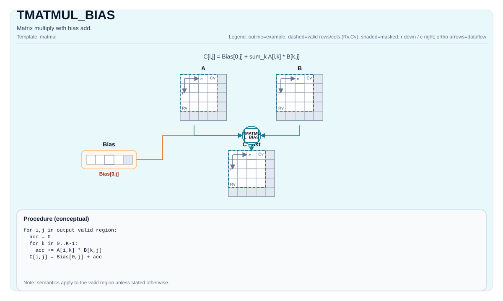

# TMATMUL_BIAS


## 指令示意图




## 简介


`TMATMUL_BIAS` 表示“矩阵乘法后立即并入列偏置”。它表达的是矩阵乘积再加一行 bias，而不是另一种不同的乘法。

把 bias 作为这条指令的显式输入，有两个好处：一是合同清楚，二是文档不必把“先做 matmul、再做逐元素加”误写成完全等价的抽象。

## 数学语义


设：

- `M = aMatrix.GetValidRow()`
- `K = aMatrix.GetValidCol()`
- `N = bMatrix.GetValidCol()`

对 `0 <= i < M`、`0 <= j < N`：

$$ \mathrm{C}_{i,j} = \sum_{k=0}^{K-1} \mathrm{A}_{i,k} \cdot \mathrm{B}_{k,j} + \mathrm{Bias}_{0,j} $$

Bias tile 只有一行，因此它按输出列广播。

## 机制


`TMATMUL_BIAS` 仍然走 `Left` / `Right` / `Acc` 的 cube 路径，只是在乘积生成后再引入一块 `Bias` tile。

这条指令要求 bias 是“单行偏置 tile”，而不是任意 shape 的普通 tile。也正因为如此，它表达的是列偏置，而不是一般意义上的逐元素加法。

## 汇编语法


PTO-AS 形式：参见 [汇编写法与操作数](../../../syntax-and-operands/assembly-model_zh.md)。

同步形式：

```text
%acc = tmatmul.bias %a, %b, %bias : (!pto.tile<...>, !pto.tile<...>, !pto.tile<...>) -> !pto.tile<...>
```

### AS Level 1（SSA）


```text
%c = pto.tmatmul.bias %a, %b, %bias : (!pto.tile<...>, !pto.tile<...>, !pto.tile<...>) -> !pto.tile<...>
```

### AS Level 2（DPS）


```text
pto.tmatmul.bias ins(%a, %b, %bias : !pto.tile_buf<...>, !pto.tile_buf<...>, !pto.tile_buf<...>) outs(%c : !pto.tile_buf<...>)
```

## C++ 内建接口


声明于 `include/pto/common/pto_instr.hpp`：

```cpp
template <typename TileRes, typename TileLeft, typename TileRight, typename TileBias, typename... WaitEvents>
PTO_INST RecordEvent TMATMUL_BIAS(TileRes &cMatrix, TileLeft &aMatrix, TileRight &bMatrix, TileBias &biasData,
                                  WaitEvents &... events);

template <AccPhase Phase, typename TileRes, typename TileLeft, typename TileRight, typename TileBias,
          typename... WaitEvents>
PTO_INST RecordEvent TMATMUL_BIAS(TileRes &cMatrix, TileLeft &aMatrix, TileRight &bMatrix, TileBias &biasData,
                                  WaitEvents &... events);
```

## 输入与输出


- `aMatrix`：左操作数 tile，必须是 `Left`。
- `bMatrix`：右操作数 tile，必须是 `Right`。
- `biasData`：偏置 tile，必须是 `Bias`，且为单行。
- `cMatrix`：结果累加器 tile，必须是 `Acc`。

输出合同是：先得到矩阵乘积，再把 `bias[0, j]` 加到每个输出列 `j` 上。

## 约束


!!! warning "约束"
    ### 通用约束

    - `TMATMUL` 的所有 shape、角色、dtype 和 target-profile 约束在这里同样成立；
    - `biasData` 的数据类型必须与结果累加器 `TileRes::DType` 一致；
    - `biasData` 必须是单行 Bias tile。

    ### A2A3 约束

    `A2A3` 指 Ascend 910B 与 Ascend 910C。当前实现要求：

    - `TileBias::Loc == TileType::Bias`
    - `TileBias::Rows == 1`

    ### A5 约束

    `A5` 指 Ascend 950 PR 与 Ascend 950 DT。当前实现要求：

    - `TileBias::Loc == TileType::Bias`
    - `TileBias::Rows == 1`
    - `TileBias::isRowMajor == true`

## 不允许的情形


!!! danger "不允许的情形"
    - 用普通 tile 代替 Bias tile；
    - bias 不是单行；
    - bias dtype 与结果累加器 dtype 不一致；
    - 违反 `TMATMUL` 的任一合法性约束。

## 性能与吞吐


当前仓内 A2A3 costmodel 对 `TMATMUL_BIAS` 仍复用 `mad/mmad` 的同一套模型，周期口径与 `TMATMUL` 一致：

```text
cycles = 14 + ceil(M/16) * ceil(N/16) * ceil(K / baskK) * repeat_cost
```

其中：

- `baskK = 32 / sizeof(left_element_type)`；
- int8、fp16 bucket 的 `repeat_cost = 1`；
- fp32 bucket 的 `repeat_cost = 2`。

当前仓库没有单列的 A5 latency / throughput 表。

## 示例


### 自动（Auto）


```cpp
#include <pto/pto-inst.hpp>

using namespace pto;

void example_auto() {
  using A = TileLeft<half, 16, 16>;
  using B = TileRight<half, 16, 16>;
  using Bias = Tile<TileType::Bias, float, 1, 16>;
  using C = TileAcc<float, 16, 16>;
  A a;
  B b;
  Bias bias;
  C c;
  TMATMUL_BIAS(c, a, b, bias);
}
```

### 手动（Manual）


```cpp
#include <pto/pto-inst.hpp>

using namespace pto;

void example_manual() {
  using A = TileLeft<half, 16, 16>;
  using B = TileRight<half, 16, 16>;
  using Bias = Tile<TileType::Bias, float, 1, 16>;
  using C = TileAcc<float, 16, 16>;
  A a;
  B b;
  Bias bias;
  C c;
  TASSIGN(a, 0x1000);
  TASSIGN(b, 0x2000);
  TASSIGN(bias, 0x3000);
  TASSIGN(c, 0x4000);
  TMATMUL_BIAS(c, a, b, bias);
}
```

## 相关页面


- [TMATMUL](./tmatmul_zh.md)
- [TMATMUL_ACC](./tmatmul-acc_zh.md)
- [TMATMUL_MX](./tmatmul-mx_zh.md)
- [矩阵与矩阵-向量指令集](../../matrix-and-matrix-vector_zh.md)

# pto.tmatmul_bias
本节与英文同名章节对齐，后续可继续补充更细粒度中文说明。

## Summary
本节给出该指令/主题的核心语义与使用定位，和英文章节保持一致。

## Mechanism
本节说明执行机制与关键语义规则，细节与边界条件以英文版为准。

## Syntax
本节列出语法形态（SSA / DPS / Assembly），用于与英文页逐项对照。

### AS Level 1 (SSA)
本节与英文同名章节对齐，后续可继续补充更细粒度中文说明。

### AS Level 2 (DPS)
本节与英文同名章节对齐，后续可继续补充更细粒度中文说明。

### IR Level 1 (SSA)
本节与英文同名章节对齐，后续可继续补充更细粒度中文说明。

### IR Level 2 (DPS)
本节与英文同名章节对齐，后续可继续补充更细粒度中文说明。

## C++ Intrinsic
本节给出 C++ 内建接口入口与参数语义说明。

## Inputs
本节定义输入操作数角色、数据来源与有效区域要求。

## Expected Outputs
本节定义输出结果及其在有效区域内的语义保证。

## Side Effects
本节说明除结果写回外是否存在额外可观察副作用。

## Constraints
本节列出类型、布局、shape、valid-region 与 profile 相关约束。

## Exceptions
本节描述非法输入、不支持组合与验证失败行为。

## Target-Profile Restrictions
本节给出 A2/A3、A5 及 CPU-SIM 的差异化限制与行为说明。

## Examples
本节提供 Auto/Manual 及 AS 形式示例，便于中英文对照复现。

### Auto
本节与英文同名章节对齐，后续可继续补充更细粒度中文说明。

### Manual
本节与英文同名章节对齐，后续可继续补充更细粒度中文说明。

### Auto Mode
本节与英文同名章节对齐，后续可继续补充更细粒度中文说明。

# Auto mode: compiler/runtime-managed placement and scheduling.
本节与英文同名章节对齐，后续可继续补充更细粒度中文说明。

### Manual Mode
本节与英文同名章节对齐，后续可继续补充更细粒度中文说明。

# Manual mode: bind resources explicitly before issuing the instruction.
本节与英文同名章节对齐，后续可继续补充更细粒度中文说明。

# Optional for tile operands:
本节与英文同名章节对齐，后续可继续补充更细粒度中文说明。

# pto.tassign %arg0, @tile(0x1000)
本节与英文同名章节对齐，后续可继续补充更细粒度中文说明。

# pto.tassign %arg1, @tile(0x2000)
本节与英文同名章节对齐，后续可继续补充更细粒度中文说明。

### PTO Assembly Form
本节与英文同名章节对齐，后续可继续补充更细粒度中文说明。

# AS Level 2 (DPS)
本节与英文同名章节对齐，后续可继续补充更细粒度中文说明。

## Related Ops / Instruction Set Links
本节给出上下游指令与相关章节链接。
