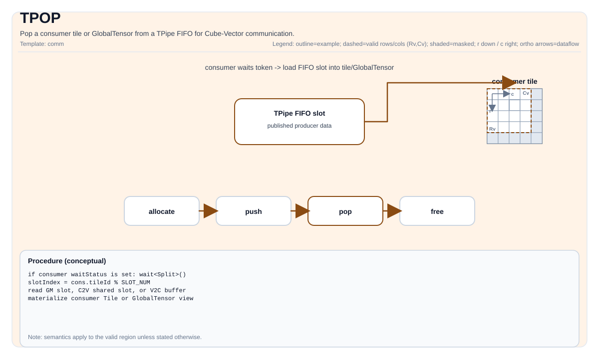

# pto.tpop

## Instruction Diagram



`pto.tpop` is part of the [Sync And Config](../../sync-and-config.md) instruction set.

## Summary

Pop a tile from a pipe or FIFO consumer endpoint after the producer has made data available.

## Mechanism

`pto.tpop` consumes a tile payload from a pipe or FIFO consumer endpoint after the producer side has published it. It is part of the tile synchronization or configuration shell, so the visible effect is state handoff and ordering rather than arithmetic payload transformation.

Unless otherwise specified, semantics are defined over the destination valid region and target-dependent behavior is marked as implementation-defined.

## Syntax

Textual spelling is defined by the PTO ISA syntax-and-operands pages.

Schematic form:

```text
%dst = pto.tpop %pipe : !pto.pipe<...> -> !pto.tile<...>
```

### AS Level 1 (SSA)

```text
%dst = pto.tpop %pipe : (!pto.pipe<...>) -> !pto.tile<...>
```

### AS Level 2 (DPS)

```text
pto.tpop ins(%pipe : !pto.pipe<...>) outs(%dst : !pto.tile_buf<...>)
```

### IR Level 1 (SSA)

```text
%dst = pto.tpop %pipe : (!pto.pipe<...>) -> !pto.tile<...>
```

### IR Level 2 (DPS)

```text
pto.tpop ins(%pipe : !pto.pipe<...>) outs(%dst : !pto.tile_buf<...>)
```

## C++ Intrinsic

Declared in `include/pto/common/pto_instr.hpp`.

## Inputs

- `pipe` is the consumer endpoint carrying the queued tile payload.
- `dst` names the destination tile receiving the popped payload.

## Expected Outputs

`dst` receives the tile payload produced by the matching producer-side operation.

## Side Effects

This operation may establish consumer-side ordering, advance FIFO state, and release or recycle implementation-defined queue resources.

## Constraints

- Exact legality for tile type, split mode, and pipe direction is backend-dependent.
- Programs must pair `pto.tpop` with a compatible producer-side operation such as `pto.tpush`.
- Queue empty / ready semantics beyond the documented PTO-visible contract are implementation-defined.

## Exceptions

- Illegal operand tuples, unsupported types, invalid layout combinations, or unsupported target-profile modes are rejected by the verifier or by the selected backend instruction set.
- Programs must not rely on behavior outside the documented legal domain of this operation, even if one backend currently accepts it.

## Target-Profile Restrictions

- `pto.tpop` preserves PTO-visible semantics across CPU simulation and supported NPU backends, but concrete support subsets may differ by profile.
- Portable code must rely only on the documented type, layout, shape, and mode combinations that the selected target profile guarantees.

## Examples

See related examples in `docs/isa/` and `docs/coding/tutorials/`.

### Auto Mode

```text
# Auto mode: compiler/runtime-managed placement and scheduling.
%dst = pto.tpop %pipe : (!pto.pipe<...>) -> !pto.tile<...>
```

### Manual Mode

```text
# Manual mode: bind resources explicitly before issuing the instruction.
# Optional for tile operands:
# pto.tassign %arg0, @tile(0x1000)
%dst = pto.tpop %pipe : (!pto.pipe<...>) -> !pto.tile<...>
```

### PTO Assembly Form

```text
%dst = pto.tpop %pipe : (!pto.pipe<...>) -> !pto.tile<...>
# AS Level 2 (DPS)
pto.tpop ins(%pipe : !pto.pipe<...>) outs(%dst : !pto.tile_buf<...>)
```

## Related Ops / Instruction Set Links

- Instruction set overview: [Sync And Config](../../sync-and-config.md)
- Previous related op: [pto.tpush](./tpush.md)
