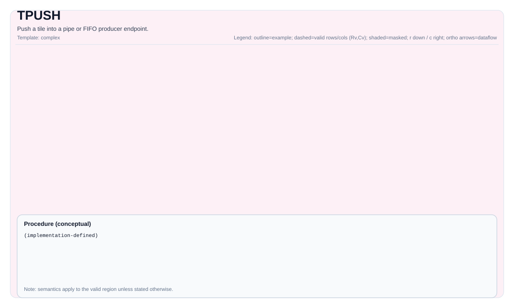

# pto.tpush

## Instruction Diagram



`pto.tpush` is part of the [Sync And Config](../../sync-and-config.md) instruction set.

## Summary

Push a tile into a pipe or FIFO producer endpoint for cross-stage or cross-core transfer.

## Mechanism

`pto.tpush` publishes a tile payload into a pipe or FIFO producer endpoint so that a later consumer-side operation such as `pto.tpop` can observe it. It is part of the tile synchronization or configuration shell, so the visible effect is state handoff and ordering rather than arithmetic payload transformation.

Unless otherwise specified, semantics are defined over the valid region and target-dependent behavior is marked as implementation-defined.

## Syntax

Textual spelling is defined by the PTO ISA syntax-and-operands pages.

Schematic form:

```text
pto.tpush %src, %pipe : !pto.tile<...>, !pto.pipe<...> -> ()
```

### AS Level 1 (SSA)

```text
pto.tpush %src, %pipe : (!pto.tile<...>, !pto.pipe<...>) -> ()
```

### AS Level 2 (DPS)

```text
pto.tpush ins(%src, %pipe : !pto.tile_buf<...>, !pto.pipe<...>) outs()
```

### IR Level 1 (SSA)

```text
pto.tpush %src, %pipe : (!pto.tile<...>, !pto.pipe<...>) -> ()
```

### IR Level 2 (DPS)

```text
pto.tpush ins(%src, %pipe : !pto.tile_buf<...>, !pto.pipe<...>) outs()
```

## C++ Intrinsic

Declared in `include/pto/common/pto_instr.hpp`.

## Inputs

- `src` is the source tile to publish into the pipe or FIFO.
- `pipe` is the producer endpoint carrying the queued tile payload.

## Expected Outputs

This form is defined primarily by its ordering or queue-publication effect. It does not introduce a new payload tile beyond the pipe or FIFO state updated by the operation.

## Side Effects

This operation may establish producer-to-consumer ordering, advance FIFO state, and update implementation-defined on-chip communication metadata.

## Constraints

- Exact legality for tile type, split mode, and pipe direction is backend-dependent.
- Programs must pair `pto.tpush` with a compatible consumer-side operation such as `pto.tpop`.
- Cross-core FIFO semantics are implementation-defined beyond the documented PTO-visible contract.

## Exceptions

- Illegal operand tuples, unsupported types, invalid layout combinations, or unsupported target-profile modes are rejected by the verifier or by the selected backend instruction set.
- Programs must not rely on behavior outside the documented legal domain of this operation, even if one backend currently accepts it.

## Target-Profile Restrictions

- `pto.tpush` preserves PTO-visible semantics across CPU simulation and supported NPU backends, but concrete support subsets may differ by profile.
- Portable code must rely only on the documented type, layout, shape, and mode combinations that the selected target profile guarantees.

## Examples

See related examples in `docs/isa/` and `docs/coding/tutorials/`.

### Auto Mode

```text
# Auto mode: compiler/runtime-managed placement and scheduling.
pto.tpush %src, %pipe : (!pto.tile<...>, !pto.pipe<...>) -> ()
```

### Manual Mode

```text
# Manual mode: bind resources explicitly before issuing the instruction.
# Optional for tile operands:
# pto.tassign %arg0, @tile(0x1000)
pto.tpush %src, %pipe : (!pto.tile<...>, !pto.pipe<...>) -> ()
```

### PTO Assembly Form

```text
pto.tpush %src, %pipe : (!pto.tile<...>, !pto.pipe<...>) -> ()
# AS Level 2 (DPS)
pto.tpush ins(%src, %pipe : !pto.tile_buf<...>, !pto.pipe<...>) outs()
```

## Related Ops / Instruction Set Links

- Instruction set overview: [Sync And Config](../../sync-and-config.md)
- Next related op: [pto.tpop](./tpop.md)
