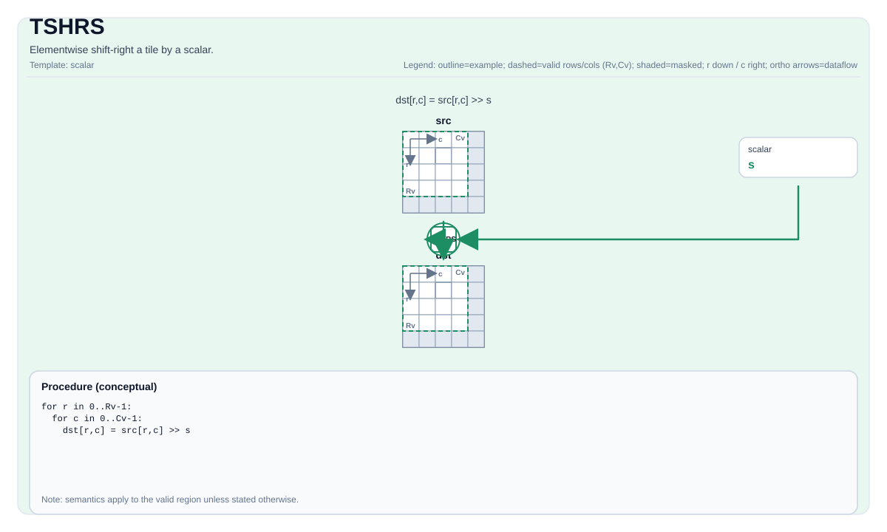

# TSHRS

## 指令示意图




## 简介


Tile 按标量逐元素右移。

## 数学语义


对每个元素 `(i, j)` 在有效区域内：

$$ \mathrm{dst}_{i,j} = \mathrm{src}_{i,j} \gg \mathrm{scalar} $$

## 汇编语法


PTO-AS 形式：参见 [汇编写法与操作数](../../../syntax-and-operands/assembly-model_zh.md)。

同步形式：

```text
%dst = tshrs %src, %scalar : !pto.tile<...>, i32
```

### AS Level 1（SSA）


```text
%dst = pto.tshrs %src, %scalar : (!pto.tile<...>, dtype) -> !pto.tile<...>
```

### AS Level 2（DPS）


```text
pto.tshrs ins(%src, %scalar : !pto.tile_buf<...>, dtype) outs(%dst : !pto.tile_buf<...>)
```

## C++ 内建接口


声明于 `include/pto/common/pto_instr.hpp`：

```cpp
template <typename TileDataDst, typename TileDataSrc, typename... WaitEvents>
PTO_INST RecordEvent TSHRS(TileDataDst &dst, TileDataSrc &src, typename TileDataDst::DType scalar, WaitEvents &... events);
```

## 约束


!!! warning "约束"
    - **实现检查 (A2A3)**:
        - 支持的元素类型为 `int32_t`、`int`、`int16_t`、`uint32_t`、`unsigned int` 和 `uint16_t`。
        - `dst` 和 `src` 必须使用相同的元素类型。
        - `dst` 和 `src` 必须是向量 Tile。
        - 运行时：`src.GetValidRow() == dst.GetValidRow()` 且 `src.GetValidCol() == dst.GetValidCol()`。
        - 标量仅支持零和正值。
    - **实现检查 (A5)**:
        - 支持的元素类型为 `int32_t`、`int16_t`、`int8_t`、`uint32_t`、`uint16_t` 和 `uint8_t`。
        - `dst` 和 `src` 必须使用相同的元素类型。
        - `dst` 和 `src` 必须是向量 Tile。
        - 两个 Tile 的静态有效边界都必须满足 `ValidRow <= Rows` 且 `ValidCol <= Cols`。
        - 运行时：`src.GetValidRow() == dst.GetValidRow()` 且 `src.GetValidCol() == dst.GetValidCol()`。
        - 标量仅支持零和正值。
    - **有效区域**:
        - 该操作使用 `dst.GetValidRow()` / `dst.GetValidCol()` 作为迭代域。

## 示例


```cpp
#include <pto/pto-inst.hpp>

using namespace pto;

void example() {
  using TileDst = Tile<TileType::Vec, uint16_t, 16, 16>;
  using TileSrc = Tile<TileType::Vec, uint16_t, 16, 16>;
  TileDst dst;
  TileSrc src;
  TSHRS(dst, src, 0x2);
}
```

## 汇编示例（ASM）


### 自动模式


```text
# 自动模式：由编译器/运行时负责资源放置与调度。
%dst = pto.tshrs %src, %scalar : (!pto.tile<...>, dtype) -> !pto.tile<...>
```

### 手动模式


```text
# 手动模式：先显式绑定资源，再发射指令。
# 可选（当该指令包含 tile 操作数时）：
# pto.tassign %arg0, @tile(0x1000)
# pto.tassign %arg1, @tile(0x2000)
%dst = pto.tshrs %src, %scalar : (!pto.tile<...>, dtype) -> !pto.tile<...>
```

### PTO 汇编形式


```text
%dst = tshrs %src, %scalar : !pto.tile<...>, i32
# AS Level 2 (DPS)
pto.tshrs ins(%src, %scalar : !pto.tile_buf<...>, dtype) outs(%dst : !pto.tile_buf<...>)
```

# pto.tshrs
本节与英文同名章节对齐，后续可继续补充更细粒度中文说明。

## Summary
本节给出该指令/主题的核心语义与使用定位，和英文章节保持一致。

## Mechanism
本节说明执行机制与关键语义规则，细节与边界条件以英文版为准。

## Syntax
本节列出语法形态（SSA / DPS / Assembly），用于与英文页逐项对照。

### AS Level 1 (SSA)
本节与英文同名章节对齐，后续可继续补充更细粒度中文说明。

## C++ Intrinsic
本节给出 C++ 内建接口入口与参数语义说明。

## Inputs
本节定义输入操作数角色、数据来源与有效区域要求。

## Expected Outputs
本节定义输出结果及其在有效区域内的语义保证。

## Side Effects
本节说明除结果写回外是否存在额外可观察副作用。

## Constraints
本节列出类型、布局、shape、valid-region 与 profile 相关约束。

## Exceptions
本节描述非法输入、不支持组合与验证失败行为。

## Target-Profile Restrictions
本节给出 A2/A3、A5 及 CPU-SIM 的差异化限制与行为说明。

## Examples
本节提供 Auto/Manual 及 AS 形式示例，便于中英文对照复现。

### Auto Mode
本节与英文同名章节对齐，后续可继续补充更细粒度中文说明。

# Auto mode: compiler/runtime-managed placement and scheduling.
本节与英文同名章节对齐，后续可继续补充更细粒度中文说明。

### Manual Mode
本节与英文同名章节对齐，后续可继续补充更细粒度中文说明。

# Manual mode: bind resources explicitly before issuing the instruction.
本节与英文同名章节对齐，后续可继续补充更细粒度中文说明。

# Optional for tile operands:
本节与英文同名章节对齐，后续可继续补充更细粒度中文说明。

### PTO Assembly Form
本节与英文同名章节对齐，后续可继续补充更细粒度中文说明。

## Related Ops / Instruction Set Links
本节给出上下游指令与相关章节链接。
