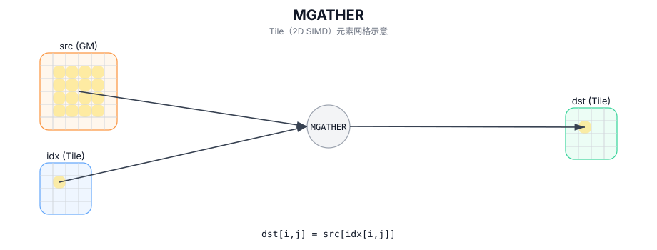

# MGATHER

## 简介

使用逐元素索引从 GM 进行 gather-load，结果写入 `dst` Tile。

## 计算流程图



## 数学解释

对于目标有效区域中的每个元素 `(i, j)`：

$$ \mathrm{dst}_{i,j} = \mathrm{mem}[\mathrm{idx}_{i,j}] $$

## 汇编语法

PTO-AS 形式：参见 `docs/grammar/PTO-AS.md`。

同步形式：

```text
%dst = mgather %mem, %idx : !pto.memref<...>, !pto.tile<...> -> !pto.tile<...>
```
## C++ Intrinsic（内建接口）

在 `include/pto/common/pto_instr.hpp` 中声明：

```cpp
template <typename TileDst, typename GlobalData, typename TileInd, typename... WaitEvents>
PTO_INST RecordEvent MGATHER(TileDst& dst, GlobalData& src, TileInd& indexes, WaitEvents&... events);
```

## 约束

- 索引解释是目标定义的。 CPU 模拟器将索引视为 `src.data()` 中的线性元素索引。
- CPU 模拟器不会对 `indexes` 执行任何边界检查。