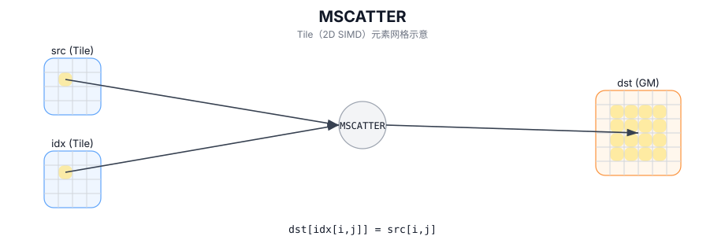

# MSCATTER

## 简介

使用逐元素索引将 `src` Tile scatter-store 写回 GM（越界/冲突写入行为实现定义）。

## 计算流程图



## 数学解释

对于源有效区域中的每个元素 `(i, j)`：

$$ \mathrm{mem}[\mathrm{idx}_{i,j}] = \mathrm{src}_{i,j} $$

如果多个元素映射到相同的目标位置，则最终值是实现定义的（CPU 模拟器：最后一个编写器按行主迭代顺序获胜）。

## 汇编语法

PTO-AS 形式：参见 `docs/grammar/PTO-AS.md`。

同步形式：

```text
mscatter %src, %mem, %idx : !pto.memref<...>, !pto.tile<...>, !pto.tile<...>
```
## C++ Intrinsic（内建接口）

在 `include/pto/common/pto_instr.hpp` 中声明：

```cpp
template <typename GlobalData, typename TileSrc, typename TileInd, typename... WaitEvents>
PTO_INST RecordEvent MSCATTER(GlobalData& dst, TileSrc& src, TileInd& indexes, WaitEvents&... events);
```

## 约束

- 索引解释是目标定义的。 CPU 模拟器将索引视为 `dst.data()` 中的线性元素索引。
- CPU 模拟器不会对 `indexes` 执行任何边界检查。