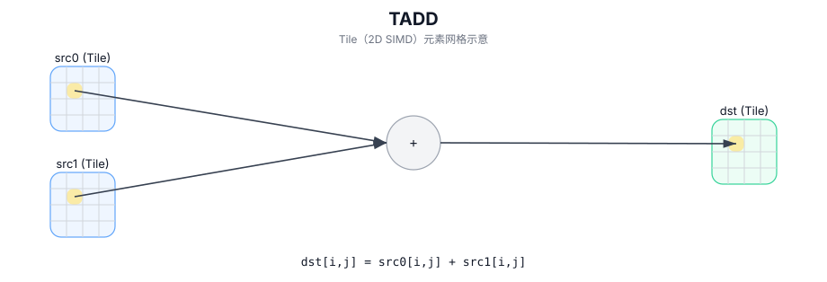

# TADD

## 简介

在 `dst` 的有效区域内，对 `src0` 与 `src1` 执行逐元素加法，结果写入 `dst`（Tile 以 2D SIMD 方式并行计算）。

## 计算流程图



## 数学解释

对于有效区域中的每个元素 `(i, j)`：

$$ \mathrm{dst}_{i,j} = \mathrm{src0}_{i,j} + \mathrm{src1}_{i,j} $$

## 汇编语法

PTO-AS 形式：参见 `docs/grammar/PTO-AS.md`。

同步形式：

```text
%dst = tadd %src0, %src1 : !pto.tile<...>
```
## C++ Intrinsic（内建接口）

在 `include/pto/common/pto_instr.hpp` 中声明：

```cpp
template <typename TileData, typename... WaitEvents>
PTO_INST RecordEvent TADD(TileData& dst, TileData& src0, TileData& src1, WaitEvents&... events);
```

## 约束

- **实现检查 (A2A3)**：
  - `TileData::DType` 必须是以下之一：`int32_t`、`int16_t`、`half`、`float`。
  - Tile 布局必须行主序 (`TileData::isRowMajor`)。
- **实现检查 (A5)**：
  - `TileData::DType` 必须是以下之一：`int32_t`、`uint32_t`、`float`、`int16_t`、`uint16_t`、`half`、 `bfloat16_t`、`uint8_t`、`int8_t`。
  - Tile 布局必须行主序 (`TileData::isRowMajor`)。
- **有效区域**：
  - 该操作使用 `dst.GetValidRow()` / `dst.GetValidCol()` 作为迭代域； `src0/src1` 被假定为兼容（未通过此操作中的显式运行时检查进行验证）。

## 示例

### 自动（Auto）

```cpp
#include <pto/pto-inst.hpp>

using namespace pto;

void example_auto() {
  using TileT = Tile<TileType::Vec, float, 16, 16>;
  TileT src0, src1, dst;
  TADD(dst, src0, src1);
}
```

### 手动（Manual）

```cpp
#include <pto/pto-inst.hpp>

using namespace pto;

void example_manual() {
  using TileT = Tile<TileType::Vec, float, 16, 16>;
  TileT src0, src1, dst;
  TASSIGN(src0, 0x1000);
  TASSIGN(src1, 0x2000);
  TASSIGN(dst,  0x3000);
  TADD(dst, src0, src1);
}
```