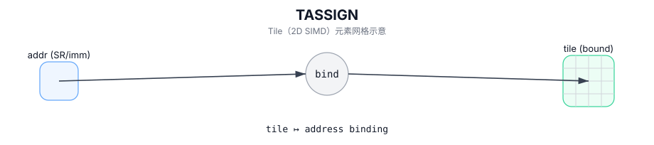

# TASSIGN

## 简介

将 Tile 对象绑定到实现定义的片上地址（手动 placement / 地址绑定）。

## 计算流程图



## 数学解释

不适用。

## 汇编语法

PTO-AS 形式：参见 `docs/grammar/PTO-AS.md`。

`TASSIGN` 通常是在将 SSA 切片映射到物理存储时通过缓冲/降低引入的。

同步形式：

```text
tassign %tile, %addr : !pto.tile<...>, index
```

## C++ Intrinsic（内建接口）

在 `include/pto/common/pto_instr.hpp` 中声明：

```cpp
template <typename T, typename AddrType>
PTO_INST void TASSIGN(T& obj, AddrType addr);
```

## 约束

- **实现检查**：
  - 如果 `obj` 是一个 Tile：
    - 在手动模式下（当未定义 `__PTO_AUTO__` 时），`addr` 必须是整数类型，并被重新解释为 Tile 的存储地址。
    - 在自动模式下（当定义 `__PTO_AUTO__` 时），`TASSIGN(tile, addr)` 是无操作。
  - 如果 `obj` 是 `GlobalTensor`：
    - `addr` 必须是指针类型。
    - 指向的元素类型必须匹配 `GlobalTensor::DType`。

## 示例

### 自动（Auto）

```cpp
#include <pto/pto-inst.hpp>

using namespace pto;

void example_auto() {
  using TileT = Tile<TileType::Vec, float, 16, 16>;
  TileT t;
  TASSIGN(t, 0x1000);
}
```

### 手动（Manual）

```cpp
#include <pto/pto-inst.hpp>

using namespace pto;

void example_manual() {
  using TileT = Tile<TileType::Vec, float, 16, 16>;
  TileT a, b, c;
  TASSIGN(a, 0x1000);
  TASSIGN(b, 0x2000);
  TASSIGN(c, 0x3000);
  TADD(c, a, b);
}
```