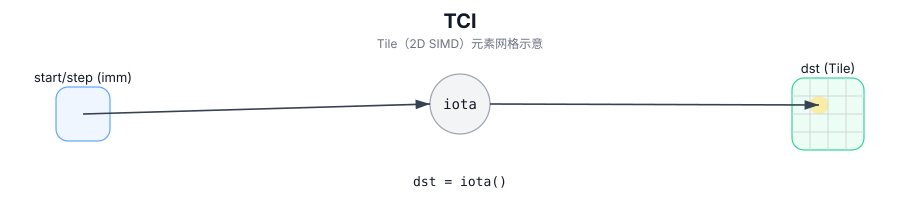

# TCI

## 简介

在目标 Tile 中生成连续整数序列（iota），用于构造索引/掩码等。

## 计算流程图



## 数学解释

对于有效元素上的线性化索引 `k`：

- 升序：

  $$ \mathrm{dst}_{k} = S + k $$

- 降序：

  $$ \mathrm{dst}_{k} = S - k $$

线性化顺序取决于 Tile 布局（实现定义）。

## 汇编语法

PTO-AS 形式：参见 `docs/grammar/PTO-AS.md`。

同步形式：

```text
%dst = tci %S {descending = false} : !pto.tile<...>
```
## C++ Intrinsic（内建接口）

在 `include/pto/common/pto_instr.hpp` 中声明：

```cpp
template <typename TileData, typename T, int descending, typename... WaitEvents>
PTO_INST RecordEvent TCI(TileData& dst, T S, WaitEvents&... events);
```

## 约束

- **实现检查（A2A3/A5）**：
  - `TileData::DType` 必须与标量模板参数 `T` 完全相同。
  - `dst/scalar` 元素类型必须相同，并且必须是以下之一：`int32_t`、`uint32_t`、`int16_t`、`uint16_t`。
  - `TileData::Cols != 1`（这是实现强制执行的条件）。
- **有效区域**：
  - 该实现使用 `dst.GetValidCol()` 作为序列长度，并且不参考 `dst.GetValidRow()`。

## 示例

### 自动（Auto）

```cpp
#include <pto/pto-inst.hpp>

using namespace pto;

void example_auto() {
  using TileT = Tile<TileType::Vec, int32_t, 1, 16>;
  TileT dst;
  TCI<TileT, int32_t, /*descending=*/0>(dst, /*S=*/0);
}
```

### 手动（Manual）

```cpp
#include <pto/pto-inst.hpp>

using namespace pto;

void example_manual() {
  using TileT = Tile<TileType::Vec, int32_t, 1, 16>;
  TileT dst;
  TASSIGN(dst, 0x1000);
  TCI<TileT, int32_t, /*descending=*/1>(dst, /*S=*/100);
}
```