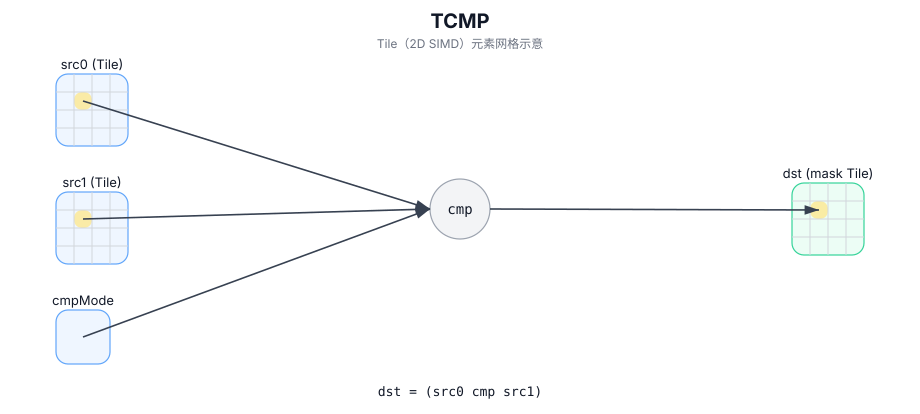

# TCMP

## 简介

按 `cmpMode` 对 `src0/src1` 做逐元素比较，并将结果以打包谓词掩码写入 `dst`（编码/布局实现定义）。

## 计算流程图



## 数学解释

从概念上讲，对于有效区域中的每个元素 `(i, j)`，定义一个谓词：

$$ p_{i,j} = \left(\mathrm{src0}_{i,j}\ \mathrm{cmpMode}\ \mathrm{src1}_{i,j}\right) $$

谓词掩码使用实现定义的打包布局存储在 `dst` 中。

## 汇编语法

PTO-AS 形式：参见 `docs/grammar/PTO-AS.md`。

同步形式：

```text
%dst = tcmp %src0, %src1 {cmpMode = #pto.cmp<EQ>} : !pto.tile<...> -> !pto.tile<...>
```
## C++ Intrinsic（内建接口）

在 `include/pto/common/pto_instr.hpp` 和 `include/pto/common/type.hpp` 中声明：

```cpp
template <typename TileDataDst, typename TileDataSrc, typename... WaitEvents>
PTO_INST RecordEvent TCMP(TileDataDst& dst, TileDataSrc& src0, TileDataSrc& src1, CmpMode cmpMode,
                          WaitEvents&... events);
```

## 约束

- **实现检查 (A2A3)**：
  - 输入类型必须是以下之一：`int32_t`、`half`、`float`。
  - 输出类型必须为 `uint8_t`。
  - `src0/src1/dst` Tile 位置必须为 `TileType::Vec`。
  - 静态有效范围：`TileDataSrc::ValidRow <= TileDataSrc::Rows` 和 `TileDataSrc::ValidCol <= TileDataSrc::Cols`。
  - 运行时：`src0.GetValidRow() == dst.GetValidRow()` 和 `src0.GetValidCol() == dst.GetValidCol()`。
  - 注意：在此实现中，`src1` 形状/有效区域 未通过显式运行时断言进行验证。
  - 对于 `TileDataSrc::DType == int32_t`，无论 `cmpMode` 如何，实现都使用 `EQ` 比较路径。
- **实现检查 (A5)**：
  - 输入类型必须是以下之一：`uint32_t`、`int32_t`、`uint16_t`、`int16_t`、`uint8_t`、`int8_t`、 `float`、`half`。
  - 输出类型必须为 `uint32_t`。
  - 已实现（参见 `include/pto/npu/a5/TCmp.hpp`）。
  - A5 实现使用 `dst.GetValidRow()` / `dst.GetValidCol()` 作为迭代域，并将打包谓词掩码写入 `dst`（目标定义的打包）。
- **掩码编码**：
  - 掩码 Tile 被解释为目标定义布局中的打包谓词位。

## 示例

### 自动（Auto）

```cpp
#include <pto/pto-inst.hpp>

using namespace pto;

void example_auto() {
  using SrcT = Tile<TileType::Vec, float, 16, 16>;
  using MaskT = Tile<TileType::Vec, uint8_t, 16, 16>;
  SrcT src0, src1;
  MaskT mask;
  TCMP(mask, src0, src1, CmpMode::GT);
}
```

### 手动（Manual）

```cpp
#include <pto/pto-inst.hpp>

using namespace pto;

void example_manual() {
  using SrcT = Tile<TileType::Vec, float, 16, 16>;
  using MaskT = Tile<TileType::Vec, uint8_t, 16, 16>;
  SrcT src0, src1;
  MaskT mask;
  TASSIGN(src0, 0x1000);
  TASSIGN(src1, 0x2000);
  TASSIGN(mask, 0x3000);
  TCMP(mask, src0, src1, CmpMode::GT);
}
```