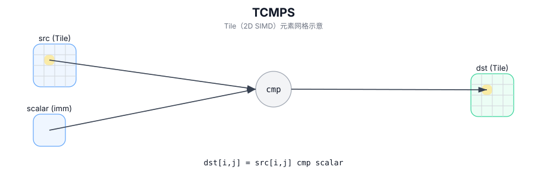

# TCMPS

## 简介

在 `dst` 的有效区域内，对 `src` 的每个元素与标量 `scalar` 执行逐元素比较，结果写入 `dst`。

## 计算流程图



## 数学解释

对于有效区域中的每个元素 `(i, j)`：

$$ \mathrm{dst}_{i,j} = \left(\mathrm{src}_{i,j}\ \mathrm{cmpMode}\ \mathrm{scalar}\right) $$

`dst` 的编码/类型是实现定义的（通常是类似掩码的 Tile）。

## 汇编语法

PTO-AS 形式：参见 `docs/grammar/PTO-AS.md`。

同步形式：

```text
%dst = tcmps %src, %scalar {cmpMode = #pto.cmp<EQ>} : !pto.tile<...> -> !pto.tile<...>
```
## C++ Intrinsic（内建接口）

在 `include/pto/common/pto_instr.hpp` 和 `include/pto/common/type.hpp` 中声明：

```cpp
template <typename TileDataDst, typename TileDataSrc0, typename T, typename... WaitEvents>
PTO_INST RecordEvent TCMPS(TileDataDst& dst, TileDataSrc0& src0, T src1, CmpMode cmpMode, WaitEvents&... events);
```

## 约束

- **实现检查 (A2A3)**：
  - `src0` 和 `dst` Tile 位置必须是向量 (`TileType::Vec`)。
  - 静态有效范围：`TileDataSrc0::ValidRow <= TileDataSrc0::Rows` 和 `TileDataSrc0::ValidCol <= TileDataSrc0::Cols`。
  - 运行时：`src0.GetValidRow() == dst.GetValidRow()` 和 `src0.GetValidCol() == dst.GetValidCol()`。
- **实现检查 (A5)**：
  - `TCMPS_IMPL` 不强制执行显式 `static_assert`/`PTO_ASSERT` 形状检查。
  - 有效支持取决于 `TileDataSrc0::DType`（在实现中仅调度特定的1/2/4字节整数/浮点类型）。
- **有效区域**：
  - 该实现使用 `dst.GetValidRow()` / `dst.GetValidCol()` 作为迭代域。

## 示例

### 自动（Auto）

```cpp
#include <pto/pto-inst.hpp>

using namespace pto;

void example_auto() {
  using SrcT = Tile<TileType::Vec, float, 16, 16>;
  using DstT = Tile<TileType::Vec, uint8_t, 16, 16>;
  SrcT src;
  DstT dst;
  TCMPS(dst, src, 0.0f, CmpMode::GT);
}
```

### 手动（Manual）

```cpp
#include <pto/pto-inst.hpp>

using namespace pto;

void example_manual() {
  using SrcT = Tile<TileType::Vec, float, 16, 16>;
  using DstT = Tile<TileType::Vec, uint8_t, 16, 16>;
  SrcT src;
  DstT dst;
  TASSIGN(src, 0x1000);
  TASSIGN(dst, 0x2000);
  TCMPS(dst, src, 0.0f, CmpMode::GT);
}
```