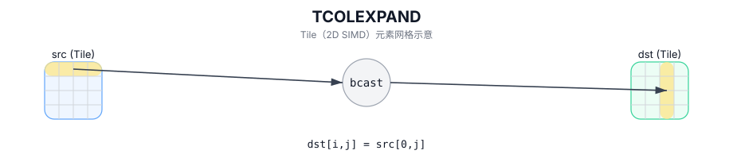

# TCOLEXPAND

## 简介

按列广播：将每列的 `src[0,j]` 广播到该列所有行，写入 `dst`。

## 计算流程图



## 数学解释

设 `R = dst.GetValidRow()` 和 `C = dst.GetValidCol()`。对于 `0 <= i < R` 和 `0 <= j < C`：

$$ \mathrm{dst}_{i,j} = \mathrm{src}_{0,j} $$

## 汇编语法

PTO-AS 形式：参见 `docs/grammar/PTO-AS.md`。

同步形式：

```text
%dst = tcolexpand %src : !pto.tile<...> -> !pto.tile<...>
```
## C++ Intrinsic（内建接口）

在 `include/pto/common/pto_instr.hpp` 中声明：

```cpp
template <typename TileDataDst, typename TileDataSrc, typename... WaitEvents>
PTO_INST RecordEvent TCOLEXPAND(TileDataDst& dst, TileDataSrc& src, WaitEvents&... events);
```

## 约束

- 操作迭代 `dst.GetValidRow()` / `dst.GetValidCol()`。

## 示例

```cpp
#include <pto/pto-inst.hpp>

using namespace pto;

void example() {
  using TileT = Tile<TileType::Vec, float, 16, 16>;
  TileT src, dst;
  TCOLEXPAND(dst, src);
}
```