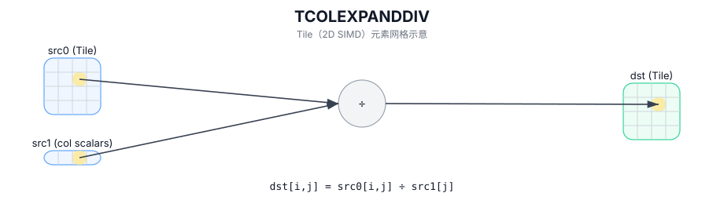

# TCOLEXPANDDIV

## 简介

按列广播运算：对 `src0` 的每一列使用 `src1` 提供的列标量（每列一个值）进行广播，并对整列逐元素计算后写入 `dst`。

## 计算流程图



## 数学解释

设 `R = dst.GetValidRow()` 和 `C = dst.GetValidCol()`。令 `s_j` 为从 `src1` 获取的每列标量（每列一个值）。

对于 `0 <= i < R` 和 `0 <= j < C`：

$$
\mathrm{dst}_{i,j} = \mathrm{src0}_{i,j} / s_j
$$

## 汇编语法

PTO-AS 形式：参见 `docs/grammar/PTO-AS.md`。

同步形式：

```text
%dst = tcolexpanddiv %src0, %src1 : !pto.tile<...>, !pto.tile<...> -> !pto.tile<...>
```

## C++ Intrinsic（内建接口）

在 `include/pto/common/pto_instr.hpp` 中声明：

```cpp
template <typename TileDataDst, typename TileDataSrc1, typename... WaitEvents>
PTO_INST RecordEvent TCOLEXPANDDIV(TileDataDst &dst, TileDataDst &src0, TileDataSrc1 &src1, WaitEvents&... events);
```

## 约束

- `src1` 预计提供**每列一个标量**（即，其有效形状必须覆盖 `C` 值）。
- 精确的布局/分形约束是特定于目标的；请参阅 `include/pto/npu/*/TColExpand*.hpp` 下的后端标头。