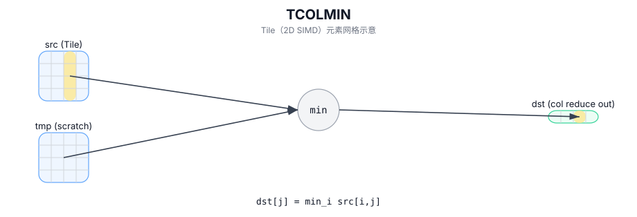

# TCOLMIN

## 简介

按列归约（最小值）：沿行方向对每一列取最小值，输出为每列一个标量（C++ Intrinsic 需要额外的 `tmp` scratch Tile）。

## 计算流程图



## 数学解释

设 `R = src.GetValidRow()` 和 `C = src.GetValidCol()`。对于 `0 <= j < C`：

$$ \mathrm{dst}_{0,j} = \min_{0 \le i < R} \mathrm{src}_{i,j} $$

## 汇编语法

PTO-AS 形式：参见 `docs/grammar/PTO-AS.md`。

同步形式：

```text
%dst = tcolmin %src : !pto.tile<...> -> !pto.tile<...>
```
## C++ Intrinsic（内建接口）

在 `include/pto/common/pto_instr.hpp` 中声明：

```cpp
template <typename TileDataOut, typename TileDataIn, typename... WaitEvents>
PTO_INST RecordEvent TCOLMIN(TileDataOut& dst, TileDataIn& src, WaitEvents&... events);
```

## 约束

实现检查（NPU）：

- Tile 位置：`dst` 和 `src` 必须为 `TileType::Vec`。
- Tile 布局：两个 Tile 都必须是 ND 分形（`isRowMajor` 和 `SLayout::NoneBox`）。
- 数据类型：
  - A2A3：`half`、`float`、`int16_t`、`int32_t`。
  - A5：`half`、`float`、`int8_t`、`uint8_t`、`int16_t`、`uint16_t`、`int32_t`、 `uint32_t`、`bfloat16_t`。
- DType 一致性：`dst.DType == src.DType`。
- 运行时有效检查：
  - `src.GetValidCol() == dst.GetValidCol()`。
  - 如果 `src.GetValidRow() == 0` 或 `src.GetValidCol() == 0`，则实现提前返回。

## 示例

### 自动（Auto）

```cpp
#include <pto/pto-inst.hpp>

using namespace pto;

void example_auto() {
  using SrcT = Tile<TileType::Vec, float, 16, 16>;
  using DstT = Tile<TileType::Vec, float, 1, 16>;
  SrcT src;
  DstT dst;
  TCOLMIN(dst, src);
}
```

### 手动（Manual）

```cpp
#include <pto/pto-inst.hpp>

using namespace pto;

void example_manual() {
  using SrcT = Tile<TileType::Vec, float, 16, 16>;
  using DstT = Tile<TileType::Vec, float, 1, 16>;
  SrcT src;
  DstT dst;
  TASSIGN(src, 0x1000);
  TASSIGN(dst, 0x2000);
  TCOLMIN(dst, src);
}
```