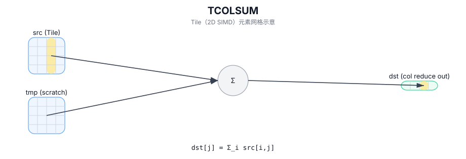

# TCOLSUM

## 简介

按列归约（求和）：沿行方向对每一列求和，输出为每列一个标量（C++ Intrinsic 需要额外的 `tmp` scratch Tile）。

## 计算流程图



## 数学解释

设 `R = src.GetValidRow()` 和 `C = src.GetValidCol()`。对于 `0 <= j < C`：

$$ \mathrm{dst}_{0,j} = \sum_{i=0}^{R-1} \mathrm{src}_{i,j} $$

`isBinary` 选择实现路径（二叉树累积与顺序累积）。

## 汇编语法

PTO-AS 形式：参见 `docs/grammar/PTO-AS.md`。

同步形式：

```text
%dst = tcolsum %src {isBinary = false} : !pto.tile<...> -> !pto.tile<...>
```
Lowering（降级）过程中可能会引入内部 scratch Tile；C++ Intrinsic（内建接口）需要显式的 `tmp` 操作数。

## C++ Intrinsic（内建接口）

在 `include/pto/common/pto_instr.hpp` 中声明：

```cpp
template <typename TileDataOut, typename TileDataIn, typename TileDataTmp, typename... WaitEvents>
PTO_INST RecordEvent TCOLSUM(TileDataOut& dst, TileDataIn& src, TileDataTmp& tmp, bool isBinary,
                             WaitEvents&... events);
```

## 约束

实现检查（NPU）：

- Tile 位置：`dst`、`src`、`tmp` 必须为 `TileType::Vec`。
- Tile 布局：所有 Tile 必须是 ND 分形（`isRowMajor` 和 `SLayout::NoneBox`）。
- DType一致性：
  - A2A3：`src.DType` 必须是 `half`、`float`、`int16_t`、`int32_t` 和 `dst.DType == tmp.DType == src.DType` 之一。
  - A5：`dst.DType == src.DType` 是 `TColReduceCheck` 所要求的；确切支持的 `src.DType` 集是目标定义的（请参阅 `include/pto/npu/a5/TColReduceOps.hpp`）。
- 运行时有效检查：
  - A2A3：`src.GetValidCol() == dst.GetValidCol()`；如果 `src.GetValidRow() == 0` 或 `src.GetValidCol() == 0` 则提前返回。
  - A5：`srcValidRow` 和 `srcValidCol` 必须非零； `srcValidCol == dstValidCol` 由 `TColReduceCheck` 断言。

## 示例

### 自动（Auto）

```cpp
#include <pto/pto-inst.hpp>

using namespace pto;

void example_auto() {
  using SrcT = Tile<TileType::Vec, float, 16, 16>;
  using DstT = Tile<TileType::Vec, float, 1, 16>;
  using TmpT = Tile<TileType::Vec, float, 16, 16>;
  SrcT src;
  DstT dst;
  TmpT tmp;
  TCOLSUM(dst, src, tmp, /*isBinary=*/false);
}
```

### 手动（Manual）

```cpp
#include <pto/pto-inst.hpp>

using namespace pto;

void example_manual() {
  using SrcT = Tile<TileType::Vec, float, 16, 16>;
  using DstT = Tile<TileType::Vec, float, 1, 16>;
  using TmpT = Tile<TileType::Vec, float, 16, 16>;
  SrcT src;
  DstT dst;
  TmpT tmp;
  TASSIGN(src, 0x1000);
  TASSIGN(dst, 0x2000);
  TASSIGN(tmp, 0x3000);
  TCOLSUM(dst, src, tmp, /*isBinary=*/false);
}
```