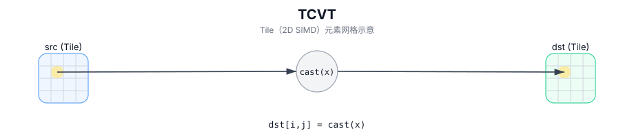

# TCVT

## 简介

在 `dst` 的有效区域内，对 `src` 执行逐元素类型转换（带舍入模式），结果写入 `dst`（Tile 以 2D SIMD 方式并行计算）。

## 计算流程图



## 数学解释

对于有效区域中的每个元素 `(i, j)`：

$$ \mathrm{dst}_{i,j} = \mathrm{cast}_{\mathrm{rmode}}\!\left(\mathrm{src}_{i,j}\right) $$

其中 `rmode` 是舍入策略（请参阅 `pto::RoundMode`）。

## 汇编语法

PTO-AS 形式：参见 `docs/grammar/PTO-AS.md`。

同步形式：

```text
%dst = tcvt %src {rmode = #pto.round_mode<CAST_RINT>} : !pto.tile<...> -> !pto.tile<...>
```
## C++ Intrinsic（内建接口）

在 `include/pto/common/pto_instr.hpp` 和 `include/pto/common/constants.hpp` 中声明：

```cpp
template <typename TileDataD, typename TileDataS, typename... WaitEvents>
PTO_INST RecordEvent TCVT(TileDataD& dst, TileDataS& src, RoundMode mode, WaitEvents&... events);
```

## 约束

- `dst` 和 `src` 必须按照实现的要求在形状/有效区域中兼容。
- 给定 `RoundMode` 的目标必须支持转换 `(src element type) -> (dst element type)`。
- **实现说明（A2A3/A5）**：
  - `TCVT_IMPL` 不对类型对强制执行额外的 `static_assert`/`PTO_ASSERT` 检查；不支持的转换是目标定义的。

## 示例

### 自动（Auto）

```cpp
#include <pto/pto-inst.hpp>

using namespace pto;

void example_auto() {
  using SrcT = Tile<TileType::Vec, float, 16, 16>;
  using DstT = Tile<TileType::Vec, half, 16, 16>;
  SrcT src;
  DstT dst;
  TCVT(dst, src, RoundMode::CAST_RINT);
}
```

### 手动（Manual）

```cpp
#include <pto/pto-inst.hpp>

using namespace pto;

void example_manual() {
  using SrcT = Tile<TileType::Vec, float, 16, 16>;
  using DstT = Tile<TileType::Vec, half, 16, 16>;
  SrcT src;
  DstT dst;
  TASSIGN(src, 0x1000);
  TASSIGN(dst, 0x2000);
  TCVT(dst, src, RoundMode::CAST_RINT);
}
```