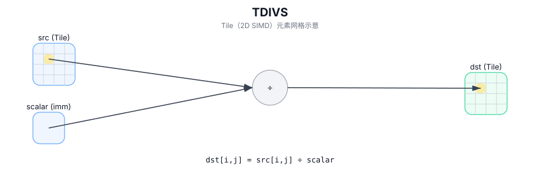

# TDIVS

## 简介

在 `dst` 的有效区域内，对 `src` 的每个元素与标量 `scalar` 执行逐元素除，结果写入 `dst`。

## 计算流程图



## 数学解释

对于有效区域中的每个元素 `(i, j)`：

- Tile/标量：

  $$ \mathrm{dst}_{i,j} = \frac{\mathrm{src}_{i,j}}{\mathrm{scalar}} $$

- 标量/Tile：

  $$ \mathrm{dst}_{i,j} = \frac{\mathrm{scalar}}{\mathrm{src}_{i,j}} $$

## 汇编语法

PTO-AS 形式：参见 `docs/grammar/PTO-AS.md`。

Tile/标量形式：

```text
%dst = tdivs %src, %scalar : !pto.tile<...>, f32
```

标量/Tile 形式：

```text
%dst = tdivs %scalar, %src : f32, !pto.tile<...>
```
## C++ Intrinsic（内建接口）

在 `include/pto/common/pto_instr.hpp` 中声明：

```cpp
template <typename TileData, typename... WaitEvents>
PTO_INST RecordEvent TDIVS(TileData& dst, TileData& src0, typename TileData::DType scalar, WaitEvents&... events);

template <typename TileData, typename... WaitEvents>
PTO_INST RecordEvent TDIVS(TileData& dst, typename TileData::DType scalar, TileData& src0, WaitEvents&... events);
```

## 约束

- **实现检查（A2A3）**（两者重载）：
  - `TileData::DType` 必须是以下之一：`int32_t`、`int`、`int16_t`、`half`、`float16_t`、`float`、 `float32_t`。
  - Tile 位置必须是向量 (`TileData::Loc == TileType::Vec`)。
  - 静态有效范围：`TileData::ValidRow <= TileData::Rows` 和 `TileData::ValidCol <= TileData::Cols`。
  - 运行时：`src0.GetValidRow() == dst.GetValidRow()` 和 `src0.GetValidCol() == dst.GetValidCol()`。
  - Tile 布局必须行主序 (`TileData::isRowMajor`)。
- **实现检查 (A5)**（均为重载）：
  - `TileData::DType` 必须是以下之一：`uint8_t`、`int8_t`、`uint16_t`、`int16_t`、`uint32_t`、`int32_t`、 `half`、`float`。
  - Tile 位置必须是向量 (`TileData::Loc == TileType::Vec`)。
  - 静态有效范围：`TileData::ValidRow <= TileData::Rows` 和 `TileData::ValidCol <= TileData::Cols`。
  - 运行时：`src0.GetValidRow() == dst.GetValidRow()` 和 `src0.GetValidCol() == dst.GetValidCol()`。
  - Tile 布局必须行主序 (`TileData::isRowMajor`)。
- **有效区域**：
  - 该操作使用 `dst.GetValidRow()` / `dst.GetValidCol()` 作为迭代域。
- **除以零**：
  - 行为是目标定义的；在 A5 上，Tile/标量形式映射为乘以倒数，并使用 `1/0 -> +inf` 表示 `scalar == 0`。

## 示例

### 自动（Auto）

```cpp
#include <pto/pto-inst.hpp>

using namespace pto;

void example_auto() {
  using TileT = Tile<TileType::Vec, float, 16, 16>;
  TileT src, dst;
  TDIVS(dst, src, 2.0f);
}
```

### 手动（Manual）

```cpp
#include <pto/pto-inst.hpp>

using namespace pto;

void example_manual() {
  using TileT = Tile<TileType::Vec, float, 16, 16>;
  TileT src, dst;
  TASSIGN(src, 0x1000);
  TASSIGN(dst, 0x2000);
  TDIVS(dst, 2.0f, src);
}
```