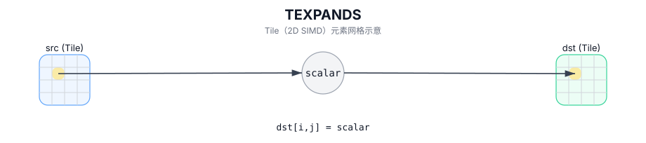

# TEXPANDS

## 简介

将标量广播填充到 `dst` Tile（构造常量 Tile / 广播常数）。

## 计算流程图



## 数学解释

对于有效区域中的每个元素 `(i, j)`：

$$ \mathrm{dst}_{i,j} = \mathrm{scalar} $$

## 汇编语法

PTO-AS 形式：参见 `docs/grammar/PTO-AS.md`。

同步形式：

```text
%dst = texpands %scalar : f32, !pto.tile<...>
```
## C++ Intrinsic（内建接口）

在 `include/pto/common/pto_instr.hpp` 中声明：

```cpp
template <typename TileData, typename... WaitEvents>
PTO_INST RecordEvent TEXPANDS(TileData& dst, typename TileData::DType scalar, WaitEvents&... events);
```

## 约束

- **实现检查 (A2A3)**：
  - `TileData::DType` 必须是以下之一：`int32_t`、`int16_t`、`half`、`float`。
  - Tile 位置必须是向量 (`TileData::Loc == TileType::Vec`)。
  - Tile 布局必须行主序 (`TileData::isRowMajor`)。
  - 静态有效范围：`TileData::ValidRow <= TileData::Rows` 和 `TileData::ValidCol <= TileData::Cols`。
- **实现检查 (A5)**：
  - `TileData::DType` 必须是以下之一：`uint8_t`、`int8_t`、`uint16_t`、`int16_t`、`uint32_t`、`int32_t`、 `half`、`float`。
  - Tile 位置必须是向量 (`TileData::Loc == TileType::Vec`)。
  - Tile 布局必须行主序 (`TileData::isRowMajor`)。
  - 静态有效范围：`TileData::ValidRow <= TileData::Rows` 和 `TileData::ValidCol <= TileData::Cols`。
- **有效区域**：
  - 该操作将 `dst` 填充到 `dst.GetValidRow()` / `dst.GetValidCol()`。

## 示例

### 自动（Auto）

```cpp
#include <pto/pto-inst.hpp>

using namespace pto;

void example_auto() {
  using TileT = Tile<TileType::Vec, float, 16, 16>;
  TileT dst;
  TEXPANDS(dst, 0.0f);
}
```

### 手动（Manual）

```cpp
#include <pto/pto-inst.hpp>

using namespace pto;

void example_manual() {
  using TileT = Tile<TileType::Vec, float, 16, 16>;
  TileT dst;
  TASSIGN(dst, 0x1000);
  TEXPANDS(dst, 0.0f);
}
```