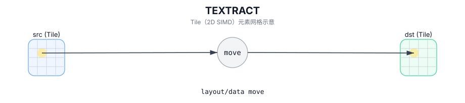

# TEXTRACT

## 简介

从源 Tile 中按 `(indexRow, indexCol)` 提取 sub-tile 并写入 `dst`。

## 计算流程图



## 数学解释

从概念上讲，将从 `(indexRow, indexCol)` 开始的窗口从 `src` 复制到 `dst`。精确的映射取决于布局。

设 `R = dst.GetValidRow()` 和 `C = dst.GetValidCol()`。对于 `0 <= i < R` 和 `0 <= j < C`：

$$ \mathrm{dst}_{i,j} = \mathrm{src}_{\mathrm{indexRow}+i,\; \mathrm{indexCol}+j} $$

## 汇编语法

PTO-AS 形式：参见 `docs/grammar/PTO-AS.md`。

同步形式：

```text
%dst = textract %src[%r0, %r1] : !pto.tile<...> -> !pto.tile<...>
```
## C++ Intrinsic（内建接口）

在 `include/pto/common/pto_instr.hpp` 中声明：

```cpp
template <typename DstTileData, typename SrcTileData, typename... WaitEvents>
PTO_INST RecordEvent TEXTRACT(DstTileData& dst, SrcTileData& src, uint16_t indexRow = 0, uint16_t indexCol = 0,
                              WaitEvents&... events);
```

## 约束

- **实现检查 (A2A3)**：
  - `DstTileData::DType` 必须等于 `SrcTileData::DType` 并且必须是以下之一：`int8_t`、`half`、`bfloat16_t`、`float`。
  - 源分形必须满足：`(SFractal == ColMajor && isRowMajor)` 或 `(SFractal == RowMajor && !isRowMajor)`。
  - 运行时边界检查：
    - `indexRow + DstTileData::Rows <= SrcTileData::Rows`
    - `indexCol + DstTileData::Cols <= SrcTileData::Cols`
  - 目标必须是具有目标支持的分形配置的 `TileType::Left` 或 `TileType::Right`。
- **实现检查 (A5)**：
  - `DstTileData::DType` 必须等于 `SrcTileData::DType` 并且必须是以下之一：`int8_t`、`hifloat8_t`、`float8_e5m2_t`、`float8_e4m3_t`、 `half`、`bfloat16_t`、`float`、`float4_e2m1x2_t`、`float4_e1m2x2_t`、`float8_e8m0_t`。
  - 源分形必须满足：`(SFractal == ColMajor && isRowMajor)` 或 `(SFractal == RowMajor && !isRowMajor)` 对于左/右，`(SFractal == RowMajor && isRowMajor)` 对于 ScaleLeft，`(SFractal == ColMajor && !isRowMajor)` 对于 ScaleRight。
  - 目标支持 `Mat -> Left/Right/Scale`，还支持特定 Tile 位置的 `Vec -> Mat`（此目标上的 `TEXTRACT_IMPL` 中不强制执行显式运行时边界断言）。

## 示例

### 自动（Auto）

```cpp
#include <pto/pto-inst.hpp>

using namespace pto;

void example_auto() {
  using SrcT = Tile<TileType::Mat, float, 16, 16, BLayout::RowMajor, 16, 16, SLayout::ColMajor>;
  using DstT = TileLeft<float, 16, 16>;
  SrcT src;
  DstT dst;
  TEXTRACT(dst, src, /*indexRow=*/0, /*indexCol=*/0);
}
```

### 手动（Manual）

```cpp
#include <pto/pto-inst.hpp>

using namespace pto;

void example_manual() {
  using SrcT = Tile<TileType::Mat, float, 16, 16, BLayout::RowMajor, 16, 16, SLayout::ColMajor>;
  using DstT = TileLeft<float, 16, 16>;
  SrcT src;
  DstT dst;
  TASSIGN(src, 0x1000);
  TASSIGN(dst, 0x2000);
  TEXTRACT(dst, src, /*indexRow=*/0, /*indexCol=*/0);
}
```