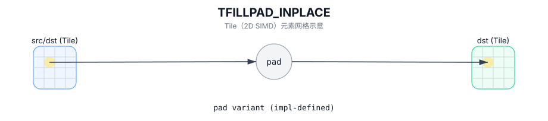

# TFILLPAD_INPLACE

## 简介

`TFILLPAD` 的 in-place 变体（实现定义）。

## 计算流程图



## See also

- TFILLPAD 概述和约束：`docs/isa/TFILLPAD.md`。

## C++ Intrinsic（内建接口）

在 `include/pto/common/pto_instr.hpp` 中声明：

```cpp
template <typename DstTileData, typename SrcTileData, typename... WaitEvents>
PTO_INST RecordEvent TFILLPAD_INPLACE(DstTileData &dst, SrcTileData &src,
                            WaitEvents&... events);
```