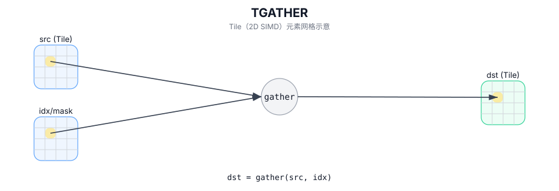

# TGATHER

## 简介

按索引 Tile 或编译期 `MaskPattern` 从源 Tile 中 gather 选取元素并写入 `dst`（越界行为实现定义）。

## 计算流程图



## 数学解释

基于索引的收集（概念性）：

设 `R = dst.GetValidRow()` 和 `C = dst.GetValidCol()`。对于 `0 <= i < R` 和 `0 <= j < C`：

$$ \mathrm{dst}_{i,j} = \mathrm{src0}\!\left[\mathrm{indices}_{i,j}\right] $$

确切的索引解释和边界行为是实现定义的。

掩码模式 gather 是由 `pto::MaskPattern` 控制的实现定义的选择/归约。

## 汇编语法

PTO-AS 形式：参见 `docs/grammar/PTO-AS.md`。

基于索引的收集：

```text
%dst = tgather %src0, %indices : !pto.tile<...> -> !pto.tile<...>
```

掩码模式 gather：

```text
%dst = tgather %src {maskPattern = #pto.mask_pattern<P0101>} : !pto.tile<...> -> !pto.tile<...>
```
## C++ Intrinsic（内建接口）

在 `include/pto/common/pto_instr.hpp` 和 `include/pto/common/type.hpp` 中声明：

```cpp
template <typename TileDataD, typename TileDataS0, typename TileDataS1, typename... WaitEvents>
PTO_INST RecordEvent TGATHER(TileDataD& dst, TileDataS0& src0, TileDataS1& src1, WaitEvents&... events);

template <typename DstTileData, typename SrcTileData, MaskPattern maskPattern, typename... WaitEvents>
PTO_INST RecordEvent TGATHER(DstTileData& dst, SrcTileData& src, WaitEvents&... events);
```

## 约束

- **基于索引的收集：实现检查 (A2A3)**：
  - `sizeof(DstTileData::DType)` 必须是 `int16_t`、`uint16_t`、`int32_t`、`uint32_t`、`half`、`float`。
  - `sizeof(Src1TileData::DType)` 必须是 `int32_t`、`uint32_t`。
  - `DstTileData::DType` 必须与 `Src0TileData::DType` 类型相同。
  - `src1.GetValidCol() == Src1TileData::Cols` 和 `dst.GetValidCol() == DstTileData::Cols`。
- **基于索引的收集：实现检查 (A5)**：
  - `sizeof(DstTileData::DType)` 必须是 `int16_t`、`uint16_t`、`int32_t`、`uint32_t`、`half`、`float`。
  - `sizeof(Src1TileData::DType)` 必须是 `int16_t`、`uint16_t`、`int32_t`、`uint32_t`。
  - `DstTileData::DType` 必须与 `Src0TileData::DType` 类型相同。
  - `src1.GetValidCol() == Src1TileData::Cols` 和 `dst.GetValidCol() == DstTileData::Cols`。
- **掩码模式 gather：实现检查（A2A3）**：
  - 源元素大小必须为 `2` 或 `4` 字节。
  - `SrcTileData::DType`/`DstTileData::DType` 必须为 `int16_t` 或 `uint16_t` 或 `int32_t` 或 `uint32_t`
    或 `half` 或 `bfloat16_t` 或 `float`。
  - `dst` 和 `src` 必须均为 `TileType::Vec` 且行主序。
  - `sizeof(dst element) == sizeof(src element)` 和 `dst.GetValidCol() == DstTileData::Cols`（连续 dst 存储）。
- **掩码模式 gather：实现检查 (A5)**：
  - 源元素大小必须为 `1` 或 `2` 或 `4` 字节。
  - `dst` 和 `src` 必须均为 `TileType::Vec` 且行主序。
  - `SrcTileData::DType`/`DstTileData::DType` 必须为 `int8_t` 或 `uint8_t` 或 `int16_t` 或 `uint16_t` 或 `int32_t` 或 `uint32_t`
    或 `half` 或 `bfloat16_t` 或 `float` 或 `float8_e4m3_t` 或 `float8_e5m2_t` 或 `hifloat8_t`。
  - 支持的数据类型仅限于目标定义的集合（在实现中通过 `static_assert` 检查）和 `sizeof(dst element) == sizeof(src element)`、`dst.GetValidCol() == DstTileData::Cols`（连续目标存储）。
- **界限/有效性**：
  - 索引边界未通过显式运行时断言进行验证；超出范围的索引是目标定义的。

## 示例

### 自动（Auto）

```cpp
#include <pto/pto-inst.hpp>

using namespace pto;

void example_auto() {
  using SrcT = Tile<TileType::Vec, float, 16, 16>;
  using IdxT = Tile<TileType::Vec, int32_t, 16, 16>;
  using DstT = Tile<TileType::Vec, float, 16, 16>;
  SrcT src0;
  IdxT idx;
  DstT dst;
  TGATHER(dst, src0, idx);
}
```

### 手动（Manual）

```cpp
#include <pto/pto-inst.hpp>

using namespace pto;

void example_manual() {
  using SrcT = Tile<TileType::Vec, float, 16, 16>;
  using DstT = Tile<TileType::Vec, float, 1, 16>;
  SrcT src;
  DstT dst;
  TASSIGN(src, 0x1000);
  TASSIGN(dst, 0x2000);
  TGATHER<DstT, SrcT, MaskPattern::P0101>(dst, src);
}
```