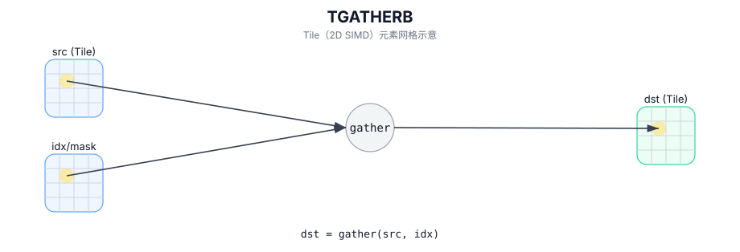

# TGATHERB

## 简介

按字节偏移从源 Tile 中 gather 选取元素并写入 `dst`（具体偏移解释实现定义）。

## 计算流程图



## 数学解释

对于有效区域中的每个元素：

$$ \mathrm{dst}_{i,j} = *\left(\mathrm{srcBase} + \mathrm{offset}_{i,j}\right) $$

确切的边界行为是实现定义的。

## 汇编语法

PTO-AS 形式：参见 `docs/grammar/PTO-AS.md`。

同步形式：

```text
%dst = tgatherb %src, %offsets : !pto.tile<...> -> !pto.tile<...>
```
## C++ Intrinsic（内建接口）

在 `include/pto/common/pto_instr.hpp` 中声明：

```cpp
template <typename TileDataDst, typename TileDataSrc, typename TileDataOffset, typename... WaitEvents>
PTO_INST RecordEvent TGATHERB(TileDataDst& dst, TileDataSrc& src, TileDataOffset& offset, WaitEvents&... events);
```

## 约束

- **实现检查 (A2A3)**：
  - 目标布局必须是行主序 (`TileDataDst::isRowMajor`)。
  - 目标元素大小必须为 `1`、`2` 或 `4` 字节（通过帮助程序中的 `static_assert` 强制执行）。
  - `SrcTileData::DType`/`DstTileData::DType` 必须为 `int8_t` 或 `uint8_t` 或 `int16_t` 或 `uint16_t` 或 `int32_t` 或 `uint32_t` 或 `half` 或 `bfloat16_t` 或 `float`。
- **实现检查 (A5)**：
  - 目标元素大小必须为 `1`、`2` 或 `4` 字节。
  - `SrcTileData::DType`/`DstTileData::DType` 必须为 `int8_t` 或 `uint8_t` 或 `int16_t` 或 `uint16_t` 或 `int32_t` 或 `uint32_t` 或 `half` 或 `bfloat16_t` 或 `float`。
- **偏移解释**：
  - 偏移量被实现解释为 `uint32_t` 值（字节偏移量）。
  - 偏移量边界未通过显式运行时断言进行验证；超出范围的偏移是目标定义的。

## 示例

### 自动（Auto）

```cpp
#include <pto/pto-inst.hpp>

using namespace pto;

void example_auto() {
  using SrcT = Tile<TileType::Vec, uint8_t, 1, 256>;
  using OffT = Tile<TileType::Vec, uint32_t, 1, 256>;
  using DstT = Tile<TileType::Vec, uint8_t, 1, 256>;
  SrcT src;
  OffT off;
  DstT dst;
  TGATHERB(dst, src, off);
}
```

### 手动（Manual）

```cpp
#include <pto/pto-inst.hpp>

using namespace pto;

void example_manual() {
  using SrcT = Tile<TileType::Vec, uint8_t, 1, 256>;
  using OffT = Tile<TileType::Vec, uint32_t, 1, 256>;
  using DstT = Tile<TileType::Vec, uint8_t, 1, 256>;
  SrcT src;
  OffT off;
  DstT dst;
  TASSIGN(src, 0x1000);
  TASSIGN(off, 0x2000);
  TASSIGN(dst, 0x3000);
  TGATHERB(dst, src, off);
}
```