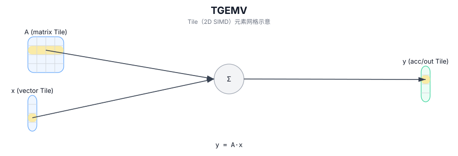

# TGEMV

## 简介

矩阵-向量乘（GEMV）：计算 `y = A · x` 并写入 accumulator/output Tile。

## 计算流程图



## 数学解释

设：

- `M = 1`
- `K = bMatrix.GetValidRow()`
- `N = bMatrix.GetValidCol()`

### 1. TGEMV (Tile-based GEMV)

对于 `0 <= j < N`（有效 matmul 域中的输出元素）：

$$ \mathrm{C}_{0,j} = \sum_{k=0}^{K-1} \mathrm{A}_{0,k} \cdot \mathrm{B}_{k,j} $$

### 2. TGEMV_ACC (Tile-based GEMV with Accumulation)

对于 `0 <= j < N`（累积到现有 Tile 中）：

$$ \mathrm{C}_{0,j} \gets \mathrm{C}_{0,j} + \sum_{k=0}^{K-1} \mathrm{A}_{0,k} \cdot \mathrm{B}_{k,j} $$

### 3. TGEMV_BIAS (Tile-based GEMV with Bias)

对于 `0 <= j < N`（向矩阵乘积添加偏差项）：

$$ \mathrm{C}_{0,j} = \mathrm{Bias}_{0,j} + \sum_{k=0}^{K-1} \mathrm{A}_{0,k} \cdot \mathrm{B}_{k,j} $$

**注意：** 精确的累加器行为和数据类型提升是目标/实现定义的。

## 汇编语法

PTO-AS 形式：参见 `docs/grammar/PTO-AS.md`。

同步形式：

```text
%acc = tgemv %a, %b : (!pto.tile<...>, !pto.tile<...>) -> !pto.tile<...>

%acc1 = tgemv.acc %acc0, %a, %b : (!pto.tile<...>, !pto.tile<...>, !pto.tile<...>) -> !pto.tile<...>

%acc = tgemv.bias %a, %b, %bias : (!pto.tile<...>, !pto.tile<...>, !pto.tile<...>) -> !pto.tile<...>
```

## C++ Intrinsic（内建接口）

在 `include/pto/common/pto_instr.hpp` 中声明：

```cpp
template <typename TileRes, typename TileLeft, typename TileRight, typename... WaitEvents>
PTO_INST RecordEvent TGEMV(TileRes &cMatrix, TileLeft &aMatrix, TileRight &bMatrix, WaitEvents&... events);

template <typename TileRes, typename TileLeft, typename TileRight, typename... WaitEvents>
PTO_INST RecordEvent TGEMV_ACC(TileRes &cOutMatrix, TileRes &cInMatrix, TileLeft &aMatrix, TileRight &bMatrix, WaitEvents&... events);

template <typename TileRes, typename TileLeft, typename TileRight, typename TileBias, typename... WaitEvents>
PTO_INST RecordEvent TGEMV_BIAS(TileRes &cMatrix, TileLeft &aMatrix, TileRight &bMatrix, TileBias &biasData, WaitEvents&... events);
```

## 约束

- **实现检查 (A2A3)**：
  - 支持的 `(CType, AType, BType)` 三元组：
    - `(int32_t, int8_t, int8_t)`
    - `(float, half, half)`
    - `(float, float, float)`
    - `(float, bfloat16_t, bfloat16_t)`
  - 静态形状约束：`TileLeft::Rows == TileRes::Rows`、`TileLeft::Cols == TileRight::Rows`、`TileRight::Cols == TileRes::Cols`。
  - Tile 位置：`TileLeft::Loc == Left`、`TileRight::Loc == Right`、`TileRes::Loc == Acc`。
  - 运行时：`m` 必须为 1 ； `k/n`（取自 `bMatrix.GetValidRow()`、`bMatrix.GetValidCol()`）必须位于 `[1, 4095]` 中。
  - 偏差检查：
    - 偏差 Tile `TileBias::DType` 的数据类型必须与结果 Tile `(TileRes::DType)` 的数据类型完全匹配。
    - 偏置 Tile 必须配置为单行。
    - 偏置 Tile 的位置必须是 `TileBias::Loc == TileType::Bias`。
- **实现检查 (A5)**：
  - 累加器类型必须为 `int32_t` 或 `float`。
    - 如果 `int32_t`：`AType == int8_t` 和 `BType == int8_t`。
    - 如果 `float`：支持 `half/bfloat16_t/float` 和选定的fp8对（目标定义）。
  - 静态形状约束：`TileLeft::Rows == TileRes::Rows`、`TileLeft::Cols == TileRight::Rows`、`TileRight::Cols == TileRes::Cols`。
  - 强制执行分形/布局约束：
    - 左：`Loc == Left`、`!isRowMajor`、`SFractal == RowMajor`
    - 右：`Loc == Right`、`isRowMajor`、`SFractal == ColMajor`
    - 累加器：`Loc == Acc`、`!isRowMajor`、`SFractal == RowMajor`
  - 在此目标上的 `TMATMUL_IMPL` 中不强制执行对 `m/k/n` 的显式运行时范围检查。
  - 运行时：`m` 必须为 1 ； `k/n`（取自 `bMatrix.GetValidRow()`、`bMatrix.GetValidCol()`）必须位于 `[1, 4095]` 中。
  - 偏差检查：
    - 偏差 Tile `TileBias::DType` 的数据类型必须与结果 Tile `(TileRes::DType)` 的数据类型完全匹配。
    - 偏置 Tile 必须配置为单行。
    - 偏置 Tile 的位置必须是 `TileBias::Loc == TileType::Bias`。

## 示例

### 自动（Auto）

#### 1. TGEMV

```cpp
#include <pto/pto-inst.hpp>

using namespace pto;

void example_auto() {
  using A = TileLeft<half, 1, 16>;
  using B = TileRight<half, 16, 16>;
  using C = TileAcc<float, 1, 16>;
  A a;
  B b;
  C c;
  TGEMV(c, a, b);
}
```

#### 2. TGEMV_ACC

```cpp
#include <pto/pto-inst.hpp>

using namespace pto;

void example_auto() {
  using A = TileLeft<half, 1, 16>;
  using B = TileRight<half, 16, 16>;
  using C = TileAcc<float, 1, 16>;
  A a;
  B b;
  C c0, c1;
  TGEMV_ACC(c, a, b);
}
```

#### 3. TGEMV_BIAS

```cpp
#include <pto/pto-inst.hpp>

using namespace pto;

void example_auto() {
  using A = TileLeft<half, 1, 16>;
  using B = TileRight<half, 16, 16>;
  using Bias = Tile<TileType::Bias, half, 1, 16>;
  using C = TileAcc<float, 1, 16>;
  A a;
  B b;
  Bias bias;
  C c;
  TGEMV_BIAS(c, a, b, bias);
}
```

### 手动（Manual）

#### 1. TGEMV

```cpp
#include <pto/pto-inst.hpp>

using namespace pto;

void example_manual() {
  using A = TileLeft<half, 1, 16>;
  using B = TileRight<half, 16, 16>;
  using C = TileAcc<float, 1, 16>;
  A a;
  B b;
  C c;
  TASSIGN(a, 0x1000);
  TASSIGN(b, 0x2000);
  TASSIGN(c, 0x3000);
  TGEMV(c, a, b);
}
```

#### 2. TGEMV_ACC

```cpp
#include <pto/pto-inst.hpp>

using namespace pto;

void example_manual() {
  using A = TileLeft<half, 1, 16>;
  using B = TileRight<half, 16, 16>;
  using C = TileAcc<float, 1, 16>;
  A a;
  B b;
  C c0, c1;
  TASSIGN(a, 0x1000);
  TASSIGN(b, 0x2000);
  TASSIGN(c0, 0x3000);
  TASSIGN(c1, 0x4000);
  TGEMV_ACC(c1, c0, a, b);
}
```

#### 3. TGEMV_BIAS

```cpp
#include <pto/pto-inst.hpp>

using namespace pto;

void example_manual() {
  using A = TileLeft<half, 1, 16>;
  using B = TileRight<half, 16, 16>;
  using Bias = Tile<TileType::Bias, half, 1, 16>;
  using C = TileAcc<float, 1, 16>;
  A a;
  B b;
  Bias bias;
  C c;
  TASSIGN(a, 0x1000);
  TASSIGN(b, 0x2000);
  TASSIGN(bias, 0x3000);
  TASSIGN(c, 0x4000);
  TGEMV_BIAS(c, a, b, bias);
}
```