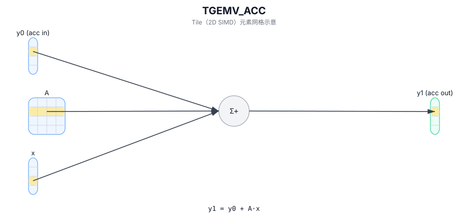

# TGEMV_ACC

## 简介

融合累加的 GEMV：计算 `y1 = y0 + A · x`（`y0` 为 accumulator 输入）。

## 计算流程图



## See also

- 完整的 GEMV 系列描述（TGEMV / TGEMV_ACC / TGEMV_BIAS）：`docs/isa/TGEMV.md`。

## C++ Intrinsic（内建接口）

在 `include/pto/common/pto_instr.hpp` 中声明：

```cpp
template <typename TileRes, typename TileLeft, typename TileRight, typename... WaitEvents>
PTO_INST RecordEvent TGEMV_ACC(TileRes &cOutMatrix, TileRes &cInMatrix, TileLeft &aMatrix, TileRight &bMatrix,
  WaitEvents&... events);
```