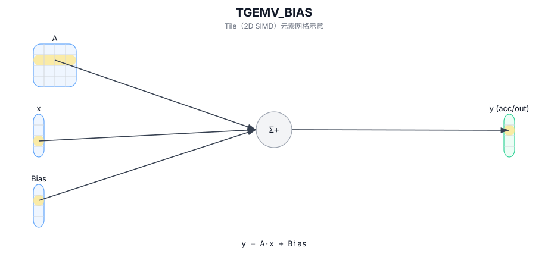

# TGEMV_BIAS

## 简介

带 bias 的 GEMV：计算 `y = A · x + Bias`（bias 语义实现定义）。

## 计算流程图



## See also

- 完整的 GEMV 系列描述（TGEMV / TGEMV_ACC / TGEMV_BIAS）：`docs/isa/TGEMV.md`。

## C++ Intrinsic（内建接口）

在 `include/pto/common/pto_instr.hpp` 中声明：

```cpp
template <typename TileRes, typename TileLeft, typename TileRight, typename TileBias, typename... WaitEvents>
PTO_INST RecordEvent TGEMV_BIAS(TileRes &cMatrix, TileLeft &aMatrix, TileRight &bMatrix, TileBias &biasData,
  WaitEvents&... events);
```