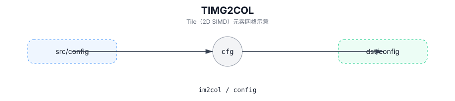

# TIMG2COL

## 简介

将输入特征图 Tile 变换为 im2col 矩阵 Tile（卷积类 workload），参数由 `Img2colTileConfig` 与 `(posM, posK)` 指定。

## 计算流程图



## C++ Intrinsic（内建接口）

在 `include/pto/common/pto_instr.hpp` 中声明：

```cpp
PTO_INST RecordEvent TIMG2COL(TileData &dst, ConvTileData &src,
                            uint16_t posM = 0, uint16_t posK = 0,
                            const Img2colTileConfig<T> &cfg = Img2colTileConfig<T>{}, WaitEvents&... events);
```

## 约束

- 该指令是特定于目标/实现的。请参阅 `include/pto/npu/*/TImg2col.hpp` 了解支持的 Tile 类型/布局和配置字段。