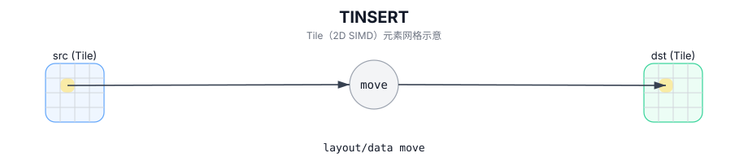

# TINSERT

## 简介

将源 sub-tile 按 `(indexRow, indexCol)` 插入到目标 Tile。

## 计算流程图



## 数学解释

设 `R = src.GetValidRow()` 和 `C = src.GetValidCol()`。从概念上讲，对于 `0 <= i < R` 和 `0 <= j < C`：

$$
\mathrm{dst}_{\mathrm{indexRow}+i,\;\mathrm{indexCol}+j} = \mathrm{src}_{i,j}
$$

## 汇编语法

PTO-AS 形式：参见 `docs/grammar/PTO-AS.md`。

同步形式：

```text
%dst = tinsert %src[%r0, %r1] : !pto.tile<...> -> !pto.tile<...>
```

## C++ Intrinsic（内建接口）

在 `include/pto/common/pto_instr.hpp` 中声明：

```cpp
template <typename DstTileData, typename SrcTileData, typename... WaitEvents>
PTO_INST RecordEvent TINSERT(DstTileData &dst, SrcTileData &src,
                            uint16_t indexRow, uint16_t indexCol, WaitEvents&... events);
```

## 约束

- 运行时边界必须满足 `indexRow + src.Rows <= dst.Rows` 和 `indexCol + src.Cols <= dst.Cols`（精确检查取决于目标）。