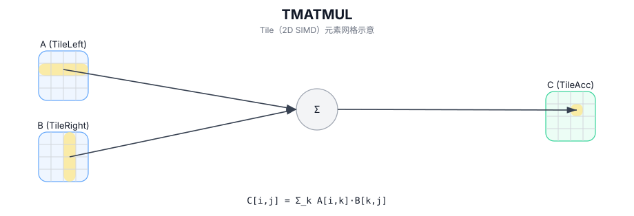

# TMATMUL

## 简介

矩阵乘（GEMM）：计算 `C = A × B` 并写入 accumulator/output Tile。

## 计算流程图



## 数学解释

设：

- `M = aMatrix.GetValidRow()`
- `K = aMatrix.GetValidCol()`
- `N = bMatrix.GetValidCol()`

对于 `0 <= i < M` 和 `0 <= j < N`（有效 matmul 域中的输出元素）：

$$ \mathrm{C}_{i,j} = \sum_{k=0}^{K-1} \mathrm{A}_{i,k} \cdot \mathrm{B}_{k,j} $$

准确的累加器行为和数据类型提升是目标/实现定义的。

## 汇编语法

PTO-AS 形式：参见 `docs/grammar/PTO-AS.md`。

同步形式：

```text
%acc = tmatmul %a, %b : (!pto.tile<...>, !pto.tile<...>) -> !pto.tile<...>
```
## C++ Intrinsic（内建接口）

在 `include/pto/common/pto_instr.hpp` 中声明：

```cpp
template <typename TileRes, typename TileLeft, typename TileRight, typename... WaitEvents>
PTO_INST RecordEvent TMATMUL(TileRes& cMatrix, TileLeft& aMatrix, TileRight& bMatrix, WaitEvents&... events);
```

## 约束

- **实现检查 (A2A3)**：
  - 支持的 `(CType, AType, BType)` 三元组：
    - `(int32_t, int8_t, int8_t)`
    - `(float, half, half)`
    - `(float, float, float)`
    - `(float, bfloat16_t, bfloat16_t)`
  - 静态形状约束：`TileLeft::Rows == TileRes::Rows`、`TileLeft::Cols == TileRight::Rows`、`TileRight::Cols == TileRes::Cols`。
  - Tile 位置：`TileLeft::Loc == Left`、`TileRight::Loc == Right`、`TileRes::Loc == Acc`。
  - 运行时：`m/k/n`（取自 `aMatrix.GetValidRow()`、`aMatrix.GetValidCol()`、`bMatrix.GetValidCol()`）必须位于 `[1, 4095]` 中。
- **实现检查 (A5)**：
  - 累加器类型必须为 `int32_t` 或 `float`。
    - 如果 `int32_t`：`AType == int8_t` 和 `BType == int8_t`。
    - 如果 `float`：支持 `half/bfloat16_t/float` 和选定的fp8对（目标定义）。
  - 静态形状约束：`TileLeft::Rows == TileRes::Rows`、`TileLeft::Cols == TileRight::Rows`、`TileRight::Cols == TileRes::Cols`。
  - 强制执行分形/布局约束：
    - 左：`Loc == Left`、`!isRowMajor`、`SFractal == RowMajor`
    - 右：`Loc == Right`、`isRowMajor`、`SFractal == ColMajor`
    - 累加器：`Loc == Acc`、`!isRowMajor`、`SFractal == RowMajor`
    - 运行时：`m/k/n`（取自 `aMatrix.GetValidRow()`、`aMatrix.GetValidCol()`、`bMatrix.GetValidCol()`）必须位于 `[1, 4095]` 中。

## 示例

### 自动（Auto）

```cpp
#include <pto/pto-inst.hpp>

using namespace pto;

void example_auto() {
  using A = TileLeft<half, 16, 16>;
  using B = TileRight<half, 16, 16>;
  using C = TileAcc<float, 16, 16>;
  A a;
  B b;
  C c;
  TMATMUL(c, a, b);
}
```

### 手动（Manual）

```cpp
#include <pto/pto-inst.hpp>

using namespace pto;

void example_manual() {
  using A = TileLeft<half, 16, 16>;
  using B = TileRight<half, 16, 16>;
  using C = TileAcc<float, 16, 16>;
  A a;
  B b;
  C c;
  TASSIGN(a, 0x1000);
  TASSIGN(b, 0x2000);
  TASSIGN(c, 0x3000);
  TMATMUL(c, a, b);
}
```