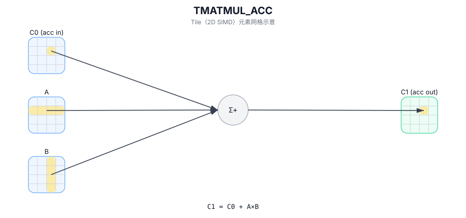

# TMATMUL_ACC

## 简介

融合累加的矩阵乘：计算 `C1 = C0 + A × B`（`C0` 为 accumulator 输入）。

## 计算流程图



## 数学解释

设：

- `M = aMatrix.GetValidRow()`
- `K = aMatrix.GetValidCol()`
- `N = bMatrix.GetValidCol()`

对于 `0 <= i < M` 和 `0 <= j < N`：

$$ \mathrm{C1}_{i,j} = \mathrm{C0}_{i,j} + \sum_{k=0}^{K-1} \mathrm{A}_{i,k} \cdot \mathrm{B}_{k,j} $$

## 汇编语法

PTO-AS 形式：参见 `docs/grammar/PTO-AS.md`。

同步形式：

```text
%acc1 = tmatmul.acc %acc0, %a, %b : (!pto.tile<...>, !pto.tile<...>, !pto.tile<...>) -> !pto.tile<...>
```
## C++ Intrinsic（内建接口）

在 `include/pto/common/pto_instr.hpp` 中声明：

```cpp
template <typename TileRes, typename TileLeft, typename TileRight, typename... WaitEvents>
PTO_INST RecordEvent TMATMUL_ACC(TileRes& cOutMatrix, TileRes& cInMatrix, TileLeft& aMatrix, TileRight& bMatrix,
                                 WaitEvents&... events);
```

## 约束

- `TMATMUL` 中的所有约束均适用于 `(cOutMatrix, aMatrix, bMatrix)` 三元组。
- **实现说明（A2A3/A5）**：
  - `TMATMUL_ACC_IMPL` 使用 `aMatrix.GetValidRow()`、`aMatrix.GetValidCol()` 和 `bMatrix.GetValidCol()` 来表示 `m/k/n`。
  - `cInMatrix` 未通过当前实现中的显式断言进行验证（目标定义的行为）。

## 示例

### 自动（Auto）

```cpp
#include <pto/pto-inst.hpp>

using namespace pto;

void example_auto() {
  using A = TileLeft<half, 16, 16>;
  using B = TileRight<half, 16, 16>;
  using C = TileAcc<float, 16, 16>;
  A a;
  B b;
  C c0, c1;
  TMATMUL_ACC(c1, c0, a, b);
}
```

### 手动（Manual）

```cpp
#include <pto/pto-inst.hpp>

using namespace pto;

void example_manual() {
  using A = TileLeft<half, 16, 16>;
  using B = TileRight<half, 16, 16>;
  using C = TileAcc<float, 16, 16>;
  A a;
  B b;
  C c0, c1;
  TASSIGN(a, 0x1000);
  TASSIGN(b, 0x2000);
  TASSIGN(c0, 0x3000);
  TASSIGN(c1, 0x4000);
  TMATMUL_ACC(c1, c0, a, b);
}
```