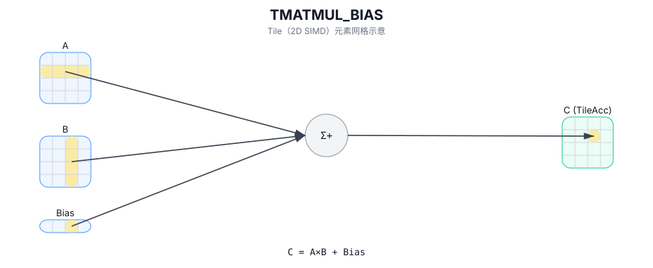

# TMATMUL_BIAS

## 简介

带 bias 的矩阵乘：计算 `C = A × B + Bias`（bias 的广播语义实现定义）。

## 计算流程图



## 数学解释

设：

- `M = aMatrix.GetValidRow()`
- `K = aMatrix.GetValidCol()`
- `N = bMatrix.GetValidCol()`

对于 `0 <= i < M` 和 `0 <= j < N`：

$$ \mathrm{C}_{i,j} = \sum_{k=0}^{K-1} \mathrm{A}_{i,k} \cdot \mathrm{B}_{k,j} + \mathrm{Bias}_{0,j} $$

偏差广播行为是实现定义的。

## 汇编语法

PTO-AS 形式：参见 `docs/grammar/PTO-AS.md`。

同步形式：

```text
%acc = tmatmul.bias %a, %b, %bias : (!pto.tile<...>, !pto.tile<...>, !pto.tile<...>) -> !pto.tile<...>
```
## C++ Intrinsic（内建接口）

在 `include/pto/common/pto_instr.hpp` 中声明：

```cpp
template <typename TileRes, typename TileLeft, typename TileRight, typename TileBias, typename... WaitEvents>
PTO_INST RecordEvent TMATMUL_BIAS(TileRes& cMatrix, TileLeft& aMatrix, TileRight& bMatrix, TileBias& biasData,
                                  WaitEvents&... events);
```

## 约束

- `TMATMUL` 中的所有约束均适用于 `(cMatrix, aMatrix, bMatrix)` 三元组。
- **偏差约束 (A2A3)**：
  - `TileBias::DType` 必须匹配 `TileRes::DType`。
  - `TileBias::Loc == TileType::Bias` 和 `TileBias::Rows == 1`。
- **偏差约束 (A5)**：
  - `TileBias::DType` 必须匹配 `TileRes::DType`。
  - `TileBias::Loc == TileType::Bias`、`TileBias::Rows == 1` 和 `TileBias::isRowMajor`。

## 示例

### 自动（Auto）

```cpp
#include <pto/pto-inst.hpp>

using namespace pto;

void example_auto() {
  using A = TileLeft<half, 16, 16>;
  using B = TileRight<half, 16, 16>;
  using Bias = Tile<TileType::Bias, half, 1, 16>;
  using C = TileAcc<float, 16, 16>;
  A a;
  B b;
  Bias bias;
  C c;
  TMATMUL_BIAS(c, a, b, bias);
}
```

### 手动（Manual）

```cpp
#include <pto/pto-inst.hpp>

using namespace pto;

void example_manual() {
  using A = TileLeft<half, 16, 16>;
  using B = TileRight<half, 16, 16>;
  using Bias = Tile<TileType::Bias, half, 1, 16>;
  using C = TileAcc<float, 16, 16>;
  A a;
  B b;
  Bias bias;
  C c;
  TASSIGN(a, 0x1000);
  TASSIGN(b, 0x2000);
  TASSIGN(bias, 0x3000);
  TASSIGN(c, 0x4000);
  TMATMUL_BIAS(c, a, b, bias);
}
```