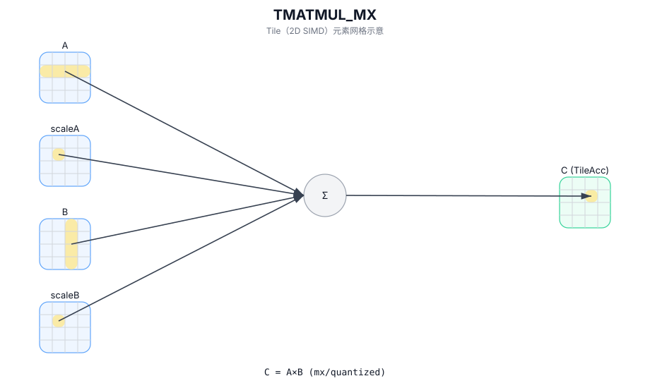

# TMATMUL_MX

## 简介

带额外缩放/量化参数的矩阵乘（mx 变体，支持范围由目标后端实现定义）。

## 计算流程图



## 数学解释

设：

- `M = aMatrix.GetValidRow()`
- `K = aMatrix.GetValidCol()`
- `N = bMatrix.GetValidCol()`

从概念上讲，结果对应于有效 matmul 域 (`0 <= i < M`、`0 <= j < N`) 上的矩阵乘法，其中缩放 Tile `aScaleMatrix` / `bScaleMatrix` 配置实现定义的混合精度行为：

$$ \mathrm{C}_{i,j} = \sum_{k=0}^{K-1} \mathrm{A}_{i,k} \cdot \mathrm{B}_{k,j} $$

`aScaleMatrix` / `bScaleMatrix`（以及任何 dequant/quant 语义）的确切角色是目标定义的。

## 汇编语法

PTO-AS 形式：参见 `docs/grammar/PTO-AS.md`。

同步形式（概念）：

```text
%c = tmatmul.mx %a, %a_scale, %b, %b_scale : (!pto.tile<...>, !pto.tile<...>, !pto.tile<...>, !pto.tile<...>) -> !pto.tile<...>
%c_out = tmatmul.mx.acc %c_in, %a, %a_scale, %b, %b_scale : (!pto.tile<...>, !pto.tile<...>, !pto.tile<...>, !pto.tile<...>, !pto.tile<...>) -> !pto.tile<...>
%c = tmatmul.mx.bias %a, %a_scale, %b, %b_scale, %bias : (!pto.tile<...>, !pto.tile<...>, !pto.tile<...>, !pto.tile<...>, !pto.tile<...>) -> !pto.tile<...>
```

## C++ Intrinsic（内建接口）

在 `include/pto/common/pto_instr.hpp` 中声明：

```cpp
template <typename TileRes, typename TileLeft, typename TileLeftScale, typename TileRight, typename TileRightScale,
    typename... WaitEvents>
PTO_INST RecordEvent TMATMUL_MX(TileRes &cMatrix, TileLeft &aMatrix, TileLeftScale &aScaleMatrix, TileRight &bMatrix,
    TileRightScale &bScaleMatrix, WaitEvents&... events);

template <typename TileRes, typename TileLeft, typename TileLeftScale, typename TileRight, typename TileRightScale,
    typename... WaitEvents>
PTO_INST RecordEvent TMATMUL_MX(TileRes &cOutMatrix, TileRes &cInMatrix, TileLeft &aMatrix, TileLeftScale &aScaleMatrix,
    TileRight &bMatrix, TileRightScale &bScaleMatrix, WaitEvents&... events);

template <typename TileRes, typename TileLeft, typename TileLeftScale, typename TileRight, typename TileRightScale,
    typename TileBias, typename... WaitEvents>
PTO_INST RecordEvent TMATMUL_MX(TileRes &cMatrix, TileLeft &aMatrix, TileLeftScale &aScaleMatrix, TileRight &bMatrix,
    TileRightScale &bScaleMatrix, TileBias &biasData, WaitEvents&... events);
```

## 约束

- **实现检查 (A5)**：
  - `m/k/n` 取自 `aMatrix.GetValidRow()`、`aMatrix.GetValidCol()`、`bMatrix.GetValidCol()`。
  - 静态合法性检查通过 `CheckMadMxValid<...>()`（类型、形状、分形和缩放 Tile 合法性）强制执行。
- **偏差形式**：
  - `TileBias::DType` 必须是 `float` 和 `TileBias::Loc == TileType::Bias` 以及 `TileBias::Rows == 1`（通过 `static_assert` 进行 A5 检查）。

## 示例

### 自动（Auto）

```cpp
#include <pto/pto-inst.hpp>

using namespace pto;

void example_auto() {
  using A = TileLeft<float8_e5m2_t, 16, 64>;
  using B = TileRight<float8_e5m2_t, 64, 32>;
  using ScaleA = TileLeftScale<float8_e8m0_t, 16, 2>;
  using ScaleB = TileRightScale<float8_e8m0_t, 2, 32>;
  using Bias = Tile<TileType::Bias, float, 1, 32>;
  using C = TileAcc<float, 16, 32>;
  A a;
  B b;
  ScaleA scaleA;
  ScaleB scaleB;
  Bias bias;
  C c;
  TMATMUL_MX(c, a, scaleA, b, scaleB, bias);
}
```

### 手动（Manual）

```cpp
#include <pto/pto-inst.hpp>

using namespace pto;

void example_manual() {
  using A = TileLeft<float8_e5m2_t, 16, 64>;
  using B = TileRight<float8_e5m2_t, 64, 32>;
  using ScaleA = TileLeftScale<float8_e8m0_t, 16, 2>;
  using ScaleB = TileRightScale<float8_e8m0_t, 2, 32>;
  using Bias = Tile<TileType::Bias, float, 1, 32>;
  using C = TileAcc<float, 16, 32>;
  A a;
  B b;
  ScaleA scaleA;
  ScaleB scaleB;
  Bias bias;
  C c;
  TASSIGN(a, 0x1000);
  TASSIGN(b, 0x2000);
  TASSIGN(scaleA, GetScaleAddr(a.data()));
  TASSIGN(scaleB, GetScaleAddr(b.data()));
  TASSIGN(bias, 0x3000);
  TASSIGN(c, 0x4000);
  TMATMUL_MX(c, a, scaleA, b, scaleB, bias);
}
```