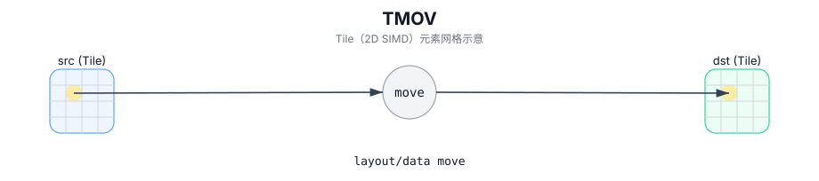

# TMOV

## 简介

Tile 间搬运/拷贝（可带实现定义的转换模式）。

## 计算流程图



## 数学解释

从概念上讲，将有效区域中的元素从 `src` 复制或转换为 `dst`。确切的转换取决于所选的模式和目标。

对于纯复制情况：

$$ \mathrm{dst}_{i,j} = \mathrm{src}_{i,j} $$

## 汇编语法

PTO-AS 形式：参见 `docs/grammar/PTO-AS.md`。

PTO IR 设计建议将 `TMOV` 拆分为一系列操作：

```text
%left  = tmov.m2l %mat  : !pto.tile<...> -> !pto.tile<...>
%right = tmov.m2r %mat  : !pto.tile<...> -> !pto.tile<...>
%bias  = tmov.m2b %mat  : !pto.tile<...> -> !pto.tile<...>
%scale = tmov.m2s %mat  : !pto.tile<...> -> !pto.tile<...>
%vec   = tmov.a2v %acc  : !pto.tile<...> -> !pto.tile<...>
%v1    = tmov.v2v %v0   : !pto.tile<...> -> !pto.tile<...>
```
## C++ Intrinsic（内建接口）

在 `include/pto/common/pto_instr.hpp` 和 `include/pto/common/constants.hpp` 中声明：

```cpp
template <typename DstTileData, typename SrcTileData, typename... WaitEvents>
PTO_INST RecordEvent TMOV(DstTileData& dst, SrcTileData& src, WaitEvents&... events);

template <typename DstTileData, typename SrcTileData, ReluPreMode reluMode, typename... WaitEvents>
PTO_INST RecordEvent TMOV(DstTileData& dst, SrcTileData& src, WaitEvents&... events);

template <typename DstTileData, typename SrcTileData, AccToVecMode mode, ReluPreMode reluMode = ReluPreMode::NoRelu,
          typename... WaitEvents>
PTO_INST RecordEvent TMOV(DstTileData& dst, SrcTileData& src, WaitEvents&... events);

template <typename DstTileData, typename SrcTileData, ReluPreMode reluMode = ReluPreMode::NoRelu,
          typename... WaitEvents>
PTO_INST RecordEvent TMOV(DstTileData& dst, SrcTileData& src, uint64_t preQuantScalar, WaitEvents&... events);

template <typename DstTileData, typename SrcTileData, AccToVecMode mode, ReluPreMode reluMode = ReluPreMode::NoRelu,
          typename... WaitEvents>
PTO_INST RecordEvent TMOV(DstTileData& dst, SrcTileData& src, uint64_t preQuantScalar, WaitEvents&... events);

template <typename DstTileData, typename SrcTileData, typename FpTileData, ReluPreMode reluMode = ReluPreMode::NoRelu,
          typename... WaitEvents>
PTO_INST RecordEvent TMOV_FP(DstTileData& dst, SrcTileData& src, FpTileData& fp, WaitEvents&... events);

template <typename DstTileData, typename SrcTileData, typename FpTileData, AccToVecMode mode,
          ReluPreMode reluMode = ReluPreMode::NoRelu, typename... WaitEvents>
PTO_INST RecordEvent TMOV(DstTileData& dst, SrcTileData& src, FpTileData& fp, WaitEvents&... events);
```

## 约束

- **实现检查 (A2A3)**：
  - 形状必须匹配：`SrcTileData::Rows == DstTileData::Rows` 和 `SrcTileData::Cols == DstTileData::Cols`。
  - 支持的位置对（编译时检查）：
    - `Mat -> Left/Right/Bias/Scaling`
    - `Vec -> Vec`
    - `Acc -> Mat`（包括通过重载可选的 pre-quant / relu / fp 变体）
  - 对于 `Acc -> Mat`，强制执行附加分形/类型约束（例如，`Acc` 使用类似 NZ 的分形，`Mat` 使用 512B 分形，并且仅允许特定的数据类型转换）。
- **实现检查 (A5)**：
  - 对于 `Mat -> *`，形状必须匹配；对于某些 `Vec` 移动，有效副本大小是 src/dst 有效行/列的最小值。
  - 支持的位置对包括（取决于目标）：
    - `Mat -> Left/Right/Bias/Scaling/Scale`
    - `Vec -> Vec` 和 `Vec -> Mat`
    - `Acc -> Vec` 和 `Acc -> Mat` （包括通过重载可选的 pre-quant / relu / fp 变体）
  - 对于 `Mat -> Left/Right`，通过 `CommonCheck` 强制执行附加分形和数据类型约束（源分形必须兼容且元素类型必须匹配）。
  - 对于 `Acc -> Vec/Mat`，通过 `CheckTMovAccValid` 强制执行额外的分形/类型/对齐约束。
  - 对于 `Mat -> Scale`，通过 `CommonCheckMX` 强制执行附加分形和数据类型约束（源分形必须兼容且元素类型必须匹配）。

## 示例

### 自动（Auto）

```cpp
#include <pto/pto-inst.hpp>

using namespace pto;

void example_auto() {
  using TileT = Tile<TileType::Vec, float, 16, 16>;
  TileT src, dst;
  TMOV(dst, src);
}
```

### 手动（Manual）

```cpp
#include <pto/pto-inst.hpp>

using namespace pto;

void example_manual() {
  using SrcT = Tile<TileType::Mat, float, 16, 16, BLayout::RowMajor, 16, 16, SLayout::ColMajor>;
  using DstT = TileLeft<float, 16, 16>;
  SrcT mat;
  DstT left;
  TASSIGN(mat, 0x1000);
  TASSIGN(left, 0x2000);
  TMOV(left, mat);
}
```