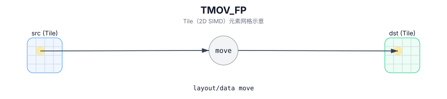

# TMOV_FP

## 简介

从 accumulator Tile 搬运/转换到目标 Tile，并使用 `fp`（scale）Tile 作为向量量化/缩放参数（实现定义）。

## 计算流程图



## 数学解释

使用源自 `fp` 的实现定义的量化/反量化配置从概念上转换每个元素：

$$ \mathrm{dst}_{i,j} = \mathrm{Convert}\!\left(\mathrm{src}_{i,j};\ \mathrm{fp}\right) $$

## 汇编语法

PTO-AS 形式：参见 `docs/grammar/PTO-AS.md`。

同步形式：

```text
%dst = tmov.fp %src, %fp : !pto.tile<...>, !pto.tile<...> -> !pto.tile<...>
```
## C++ Intrinsic（内建接口）

在 `include/pto/common/pto_instr.hpp` 和 `include/pto/common/constants.hpp` 中声明：

```cpp
template <typename DstTileData, typename SrcTileData, typename FpTileData,
          ReluPreMode reluMode = ReluPreMode::NoRelu, typename... WaitEvents>
PTO_INST RecordEvent TMOV_FP(DstTileData& dst, SrcTileData& src, FpTileData& fp, WaitEvents&... events);
```

## 约束

- **实现检查 (A2A3)**：
  - fp 路径仅支持累加器转换，并通过 `TMOV_IMPL(dst, src, fp)` 中的内部编译时检查进行验证。
  - `FpTileData::Loc` 必须为 `TileType::Scaling` (`static_assert`)。
- **实现检查 (A5)**：
  - 通过 `CheckTMovAccValid(...)` 和 `TMOV_IMPL(dst, src, fp)` 中的相关编译时检查进行验证。
  - `FpTileData::Loc` 必须为 `TileType::Scaling` (`static_assert`)。
  - 目标位置取决于目标（fp 路径支持 `Vec` 或 `Mat`）。

## 示例

### 自动（Auto）

```cpp
#include <pto/pto-inst.hpp>

using namespace pto;

void example_auto() {
  using AccT = TileAcc<float, 16, 16>;
  using DstT = Tile<TileType::Vec, int8_t, 16, 16>;
  using FpT = Tile<TileType::Scaling, uint64_t, 1, 16, BLayout::RowMajor, 1, 16, SLayout::NoneBox>;

  AccT acc;
  DstT dst;
  FpT fp;
  TMOV_FP(dst, acc, fp);
}
```

### 手动（Manual）

```cpp
#include <pto/pto-inst.hpp>

using namespace pto;

void example_manual() {
  using AccT = TileAcc<float, 16, 16>;
  using DstT = Tile<TileType::Vec, int8_t, 16, 16>;
  using FpT = Tile<TileType::Scaling, uint64_t, 1, 16, BLayout::RowMajor, 1, 16, SLayout::NoneBox>;

  AccT acc;
  DstT dst;
  FpT fp;
  TASSIGN(acc, 0x1000);
  TASSIGN(dst, 0x2000);
  TASSIGN(fp,  0x3000);
  TMOV_FP(dst, acc, fp);
}
```