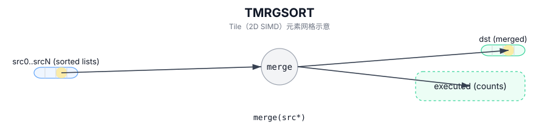

# TMRGSORT

## 简介

归并排序：将多个已排序列表合并为一个有序列表（元素格式/布局与 executed 语义实现定义）。

## 计算流程图



## 数学解释

将排序的输入列表合并到 `dst` 中。排序、元素格式（例如，值/索引对）和执行计数的含义取决于实现。

$$ \mathrm{dst} = \mathrm{merge}(\mathrm{src}_0, \mathrm{src}_1, \ldots) $$

## 汇编语法

PTO-AS 形式：参见 `docs/grammar/PTO-AS.md`。

同步形式（概念）：

```text
%dst, %executed = tmrgsort %src0, %src1 {exhausted = false}
    : !pto.tile<...>, !pto.tile<...> -> (!pto.tile<...>, vector<4xi16>)
```
## C++ Intrinsic（内建接口）

在 `include/pto/common/pto_instr.hpp` 中声明：

```cpp
template <typename DstTileData, typename TmpTileData, typename Src0TileData,
          typename Src1TileData, typename Src2TileData, typename Src3TileData,
          bool exhausted, typename... WaitEvents>
PTO_INST RecordEvent TMRGSORT(DstTileData& dst, MrgSortExecutedNumList& executedNumList,
                             TmpTileData& tmp, Src0TileData& src0, Src1TileData& src1,
                             Src2TileData& src2, Src3TileData& src3, WaitEvents&... events);

template <typename DstTileData, typename TmpTileData, typename Src0TileData,
          typename Src1TileData, typename Src2TileData, bool exhausted, typename... WaitEvents>
PTO_INST RecordEvent TMRGSORT(DstTileData& dst, MrgSortExecutedNumList& executedNumList,
                             TmpTileData& tmp, Src0TileData& src0, Src1TileData& src1,
                             Src2TileData& src2, WaitEvents&... events);

template <typename DstTileData, typename TmpTileData, typename Src0TileData,
          typename Src1TileData, bool exhausted, typename... WaitEvents>
PTO_INST RecordEvent TMRGSORT(DstTileData& dst, MrgSortExecutedNumList& executedNumList,
                             TmpTileData& tmp, Src0TileData& src0, Src1TileData& src1, WaitEvents&... events);

template <typename DstTileData, typename SrcTileData, typename... WaitEvents>
PTO_INST RecordEvent TMRGSORT(DstTileData& dst, SrcTileData& src, uint32_t blockLen, WaitEvents&... events);
```

## 约束

- **实现检查（A2A3/A5）**：
  - 元素类型必须为 `half` 或 `float` 并且必须在 `dst/tmp/src*` Tile 之间匹配。
  - 所有 Tile 必须为 `TileType::Vec`、行主序，并且具有 `Rows == 1`（存储在单行中的列表）。
  - 根据目标限制（跨输入的单个 `Cols` 加 `tmp`/`dst`）检查 UB 内存使用情况（编译时和运行时）。
- **单列表变体 (`TMRGSORT(dst, src, blockLen)`)**：
  - `blockLen` 必须是 64 的倍数（由实现检查）。
  - `src.GetValidCol()` 必须是 `blockLen * 4` 的整数倍。
  - `repeatTimes = src.GetValidCol() / (blockLen * 4)` 必须位于 `[1, 255]` 中。
- **多列表变体**：
  - `tmp` 是必需的，`executedNumList` 由实现编写；支持的列表计数和确切语义是目标定义的。

## 示例

### 自动（Auto）

```cpp
#include <pto/pto-inst.hpp>

using namespace pto;

void example_auto() {
  using SrcT = Tile<TileType::Vec, float, 1, 256>;
  using DstT = Tile<TileType::Vec, float, 1, 256>;
  SrcT src;
  DstT dst;
  TMRGSORT(dst, src, /*blockLen=*/64);
}
```

### 手动（Manual）

```cpp
#include <pto/pto-inst.hpp>

using namespace pto;

void example_manual() {
  using SrcT = Tile<TileType::Vec, float, 1, 256>;
  using DstT = Tile<TileType::Vec, float, 1, 256>;
  SrcT src;
  DstT dst;
  TASSIGN(src, 0x1000);
  TASSIGN(dst, 0x2000);
  TMRGSORT(dst, src, /*blockLen=*/64);
}
```