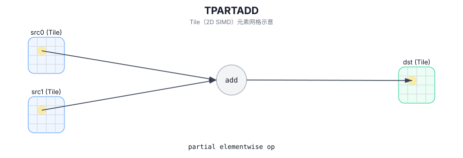

# TPARTADD

## 简介

部分逐元素运算：用于有效区域不一致场景（覆盖范围与边界行为实现定义）。

## 计算流程图



## 数学解释

对于目标有效区域中的每个元素 `(i, j)`：

$$
\mathrm{dst}_{i,j} =
\begin{cases}
\mathrm{src0}_{i,j} + \mathrm{src1}_{i,j} & \text{if both inputs are defined at } (i,j) \\
\mathrm{src0}_{i,j} & \text{if only src0 is defined at } (i,j) \\
\mathrm{src1}_{i,j} & \text{if only src1 is defined at } (i,j)
\end{cases}
$$

## 汇编语法

PTO-AS 形式：参见 `docs/grammar/PTO-AS.md`。

同步形式：

```text
%dst = tpartadd %src0, %src1 : !pto.tile<...> -> !pto.tile<...>
```
## C++ Intrinsic（内建接口）

在 `include/pto/common/pto_instr.hpp` 中声明：

```cpp
template <typename TileDataDst, typename TileDataSrc0, typename TileDataSrc1, typename... WaitEvents>
PTO_INST RecordEvent TPARTADD(TileDataDst& dst, TileDataSrc0& src0, TileDataSrc1& src1, WaitEvents&... events);
```

## 约束

- **实现检查 (A2A3)**：
  - `dst/src0/src1` 元素类型必须相同，并且必须是以下之一：`int32_t`、`int16_t`、`half`、`float`。
  - 所有三个 Tile 都必须是行主序 (`isRowMajor`)。
  - 运行时：如果 `dst.GetValidRow() == 0` 或 `dst.GetValidCol() == 0`，操作会提前返回。
  - 运行时：实现要求至少一个输入的有效区域与 `dst` 的有效区域匹配，并且另一个输入的有效区域不大于 `dst` 的有效区域（否则断言）。
- **实现检查 (A5)**：
  - `dst/src0/src1` 元素类型必须相同，并且必须是以下之一：`uint8_t`、`int8_t`、`uint16_t`、`int16_t`、`uint32_t`、 `int32_t`、`half`、`float`、`bfloat16_t`。
  - 运行时：如果 `dst` 的有效区域为零，则操作会提前返回。
  - 仅处理某些部分有效性模式（例如，一个源等于 `dst`，而另一个源小于有效行或有效列）；不支持其他模式（目标定义的行为）。

## 示例

### 自动（Auto）

```cpp
#include <pto/pto-inst.hpp>

using namespace pto;

void example_auto() {
  using TileT = Tile<TileType::Vec, float, 16, 16>;
  TileT src0, src1, dst;
  TPARTADD(dst, src0, src1);
}
```

### 手动（Manual）

```cpp
#include <pto/pto-inst.hpp>

using namespace pto;

void example_manual() {
  using TileT = Tile<TileType::Vec, float, 16, 16>;
  TileT src0, src1, dst;
  TASSIGN(src0, 0x1000);
  TASSIGN(src1, 0x2000);
  TASSIGN(dst,  0x3000);
  TPARTADD(dst, src0, src1);
}
```