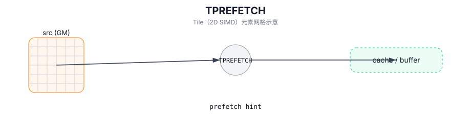

# TPREFETCH

## 简介

预取指令：将 GM 数据预取到 Tile 侧缓存/缓冲（hint，行为实现定义），用于降低后续访问延迟。

## 计算流程图



## 汇编语法

PTO-AS 形式：参见 `docs/grammar/PTO-AS.md`。

同步形式：

```text
%dst = tprefetch %src : !pto.global<...> -> !pto.tile<...>
```

## C++ Intrinsic（内建接口）

在 `include/pto/common/pto_instr.hpp` 中声明：

```cpp
template <typename TileData, typename GlobalData>
PTO_INST RecordEvent TPREFETCH(TileData &dst, GlobalData &src);
```

## 约束

- 语义和缓存行为是目标/实现定义的。
- 某些目标可能会忽略预取或将其视为提示。