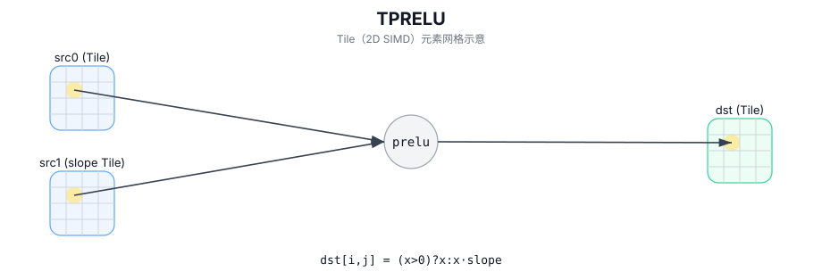

# TPRELU

## 简介

PReLU：使用 `slope` Tile 对负半轴逐元素缩放。

## 计算流程图



## 数学解释

对于有效区域中的每个元素 `(i, j)`：

$$ \mathrm{dst}_{i,j} = (\mathrm{src0}_{i,j} > 0) ? \mathrm{src0}_{i,j} : (\mathrm{src0}_{i,j} \cdot \mathrm{src1}_{i,j}) $$

## 汇编语法

PTO-AS 形式：参见 `docs/grammar/PTO-AS.md`。

同步形式：

```text
%dst = tprelu %src0, %src1 : !pto.tile<...>
```
## C++ Intrinsic（内建接口）

在 `include/pto/common/pto_instr.hpp` 中声明：

```cpp
template <typename TileData, typename... WaitEvents>
PTO_INST RecordEvent TPRELU(TileData& dst, TileData& src0, TileData& src1, WaitEvents&... events);
```

## 约束

- 操作迭代 `dst.GetValidRow()` / `dst.GetValidCol()`。
- A3需要临时空间进行计算，而A5则不需要。
- 对于A3，2个源 Tile、目标 Tile、临时空间必须位于不同的内存范围内且不能重叠。

## 示例

```cpp
#include <pto/pto-inst.hpp>

using namespace pto;

void example() {
  using TileT = Tile<TileType::Vec, float, 16, 16>;
  TileT x, slope, out, tmp;
  TPRELU(out, x, slope, tmp);
}
```