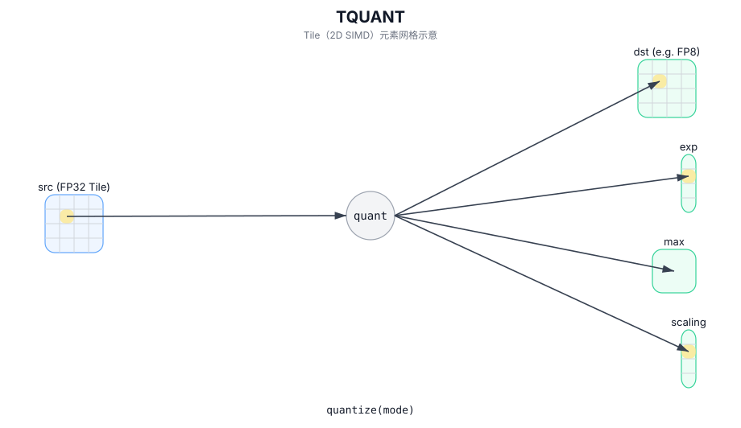

# TQUANT

## 简介

量化：将 FP32 Tile 量化为更低精度格式（如 FP8），并输出 exp/scaling/max 等辅助 Tile（实现定义）。

## 计算流程图



## C++ Intrinsic（内建接口）

在 `include/pto/common/pto_instr.hpp` 中声明：

```cpp
PTO_INST RecordEvent TQUANT(TileDataSrc &src, TileDataExp &exp, TileDataOut &dst,
                            TileDataMax &max, TileDataSrc &scaling, WaitEvents&... events);
```

## 约束

- 该指令当前针对特定目标实现（请参阅 `include/pto/npu/*/TQuant.hpp`）。
- 输入类型要求和输出 Tile 类型取决于模式/目标。