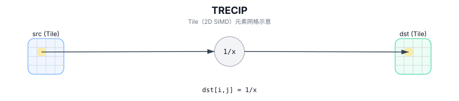

# TRECIP

## 简介

在 `dst` 的有效区域内，对 `src` 执行逐元素倒数，结果写入 `dst`（Tile 以 2D SIMD 方式并行计算）。

## 计算流程图



## 数学解释

对于有效区域中的每个元素 `(i, j)`：

$$ \mathrm{dst}_{i,j} = \frac{1}{\mathrm{src}_{i,j}} $$

## 汇编语法

PTO-AS 形式：参见 `docs/grammar/PTO-AS.md`。

同步形式：

```text
%dst = trecip %src : !pto.tile<...>
```
## C++ Intrinsic（内建接口）

在 `include/pto/common/pto_instr.hpp` 中声明：

```cpp
template <typename TileData, typename... WaitEvents>
PTO_INST RecordEvent TRECIP(TileData& dst, TileData& src, WaitEvents&... events);
```

## 约束

- **实现检查（NPU）**：
  - `TileData::DType` 必须是以下之一：`float` 或 `half`；
  - Tile 位置必须是向量 (`TileData::Loc == TileType::Vec`)；
  - 静态有效范围：`TileData::ValidRow <= TileData::Rows` 和 `TileData::ValidCol <= TileData::Cols`；
  - 运行时：`src.GetValidRow() == dst.GetValidRow()` 和 `src.GetValidCol() == dst.GetValidCol()`；
  - Tile 布局必须行主序 (`TileData::isRowMajor`)。
  - A3的TRECIP指令不支持将源 Tile 和目标 Tile 设置到同一内存。
- **有效区域**：
  - 该操作使用 `dst.GetValidRow()` / `dst.GetValidCol()` 作为迭代域。
- **域/NaN**：
  - 除零行为是目标定义的； CPU 模拟器在调试版本中断言。

## 示例

```cpp
#include <pto/pto-inst.hpp>

using namespace pto;

void example() {
  using TileT = Tile<TileType::Vec, float, 16, 16>;
  TileT x, out;
  TRECIP(out, x);
}
```