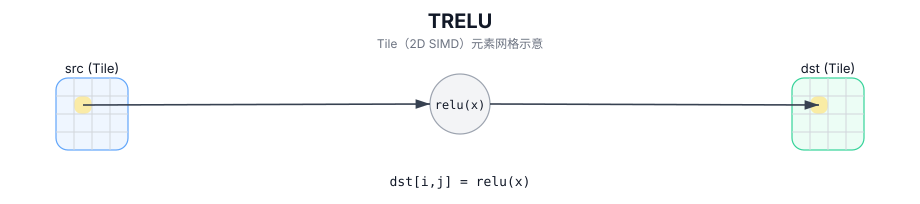

# TRELU

## 简介

在 `dst` 的有效区域内，对 `src` 执行逐元素ReLU，结果写入 `dst`（Tile 以 2D SIMD 方式并行计算）。

## 计算流程图



## 数学解释

对于有效区域中的每个元素 `(i, j)`：

$$ \mathrm{dst}_{i,j} = \max(\mathrm{src}_{i,j}, 0) $$

## 汇编语法

PTO-AS 形式：参见 `docs/grammar/PTO-AS.md`。

同步形式：

```text
%dst = trelu %src : !pto.tile<...>
```
## C++ Intrinsic（内建接口）

在 `include/pto/common/pto_instr.hpp` 中声明：

```cpp
template <typename TileData, typename... WaitEvents>
PTO_INST RecordEvent TRELU(TileData& dst, TileData& src, WaitEvents&... events);
```

## 约束

- **实现检查 (A2A3)**：
  - `TileData::DType` 必须是以下之一：`half`、`float`、`int32_t`。
  - Tile 布局必须行主序 (`TileData::isRowMajor`)。
  - Tile 位置必须是向量 (`TileData::Loc == TileType::Vec`)。
  - 静态有效范围：`TileData::ValidRow <= TileData::Rows` 和 `TileData::ValidCol <= TileData::Cols`。
  - 运行时：`src` 和 `dst` Tile 应具有相同的 `validRow/validCol`。
- **实现检查 (A5)**：
  - `TileData::DType` 必须是以下之一：`half`、`float`、`int32_t`。
  - Tile 布局必须行主序 (`TileData::isRowMajor`)。
  - Tile 位置必须是向量 (`TileData::Loc == TileType::Vec`)。
  - 静态有效范围：`TileData::ValidRow <= TileData::Rows` 和 `TileData::ValidCol <= TileData::Cols`。
  - 运行时：`src` 和 `dst` Tile 应具有相同的 `validRow/validCol`。
- **有效区域**：
  - 该操作使用 `dst.GetValidRow()` / `dst.GetValidCol()` 作为迭代域； `src/dst` 被假定为兼容（未通过此操作中的显式运行时检查进行验证）。

## 示例

```cpp
#include <pto/pto-inst.hpp>

using namespace pto;

void example() {
  using TileT = Tile<TileType::Vec, float, 16, 16>;
  TileT x, out;
  TRELU(out, x);
}
```