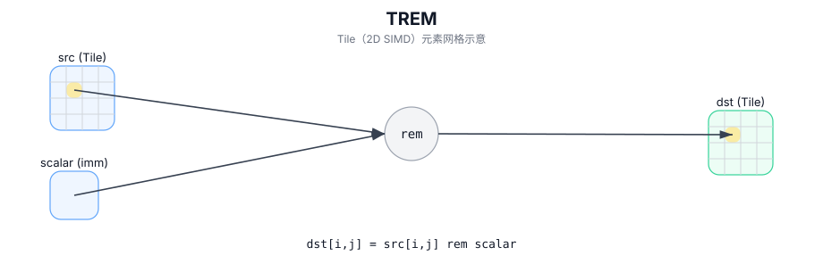

# TREM

## 简介

在 `dst` 的有效区域内，对 `src0` 与 `src1` 执行逐元素取余，结果写入 `dst`（Tile 以 2D SIMD 方式并行计算）。

## 计算流程图



## 数学解释

对于有效区域中的每个元素 `(i, j)`：

- 整数类型：

$$\mathrm{dst}_{i,j} = \mathrm{src0}_{i,j} \bmod \mathrm{src1}_{i,j}$$

- 浮动类型：

$$\mathrm{dst}_{i,j} = \mathrm{fmod}(\mathrm{src0}_{i,j}, \mathrm{src1}_{i,j})$$

## 汇编语法

PTO-AS 形式：参见 `docs/grammar/PTO-AS.md`。

同步形式：

```text
%dst = trem %src0, %src1 : !pto.tile<...>
```
## C++ Intrinsic（内建接口）

在 `include/pto/common/pto_instr.hpp` 中声明：

```cpp
template <typename TileData, typename... WaitEvents>
PTO_INST RecordEvent TREM(TileData& dst, TileData& src0, TileData& src1, WaitEvents&... events);
```

## 约束

- 操作迭代 `dst.GetValidRow()` / `dst.GetValidCol()`。
- 除零行为是目标定义的； CPU 模拟器在调试版本中断言。
- A3需要临时空间进行计算，而A5则不需要。

## 示例

```cpp
#include <pto/pto-inst.hpp>

using namespace pto;

void example() {
  using TileT = Tile<TileType::Vec, int32_t, 16, 16>;
  TileT out, a, b;
  TREM(out, a, b);
}
```