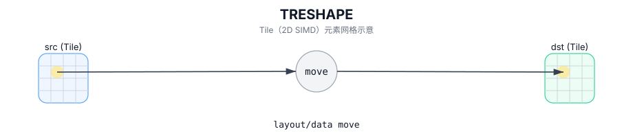

# TRESHAPE

## 简介

在不改变底层字节序列的前提下，将 Tile 重新解释为另一种 Tile 类型/形状。

## 计算流程图



## 汇编语法

PTO-AS 形式：参见 `docs/grammar/PTO-AS.md`。

```text
%dst = treshape %src : !pto.tile<...>
```

## C++ Intrinsic（内建接口）

在 `include/pto/common/pto_instr.hpp` 中声明：

```cpp
template <typename TileDataOut, typename TileDataIn, typename... WaitEvents>
PTO_INST RecordEvent TRESHAPE(TileDataOut& dst, TileDataIn& src, WaitEvents&... events);
```

## 约束

由 `TRESHAPE_IMPL` 强制执行：

- **Tile 类型必须匹配**：`TileDataIn::Loc == TileDataOut::Loc`。
- **总字节大小必须匹配**：`sizeof(InElem) * InNumel == sizeof(OutElem) * OutNumel`。
- **无盒装/非盒装转换**：
  - 无法在 `SLayout::NoneBox` 和盒装布局之间重塑。

## Notes

- **CPU 模拟**：作为逐字节复制到 `dst` 中实现。
- **A2/A3**：作为别名实现 (`TASSIGN_IMPL(dst, src.data())`)，因此 `dst` 和 `src` 引用相同的底层存储。

## 示例

```cpp
#include <pto/pto-inst.hpp>

using namespace pto;

void example() {
  using Src = Tile<TileType::Vec, float, 16, 16>;
  using Dst = Tile<TileType::Vec, float, 8, 32>;
  static_assert(Src::Numel == Dst::Numel);

  Src src;
  Dst dst;
  TRESHAPE(dst, src);
}
```